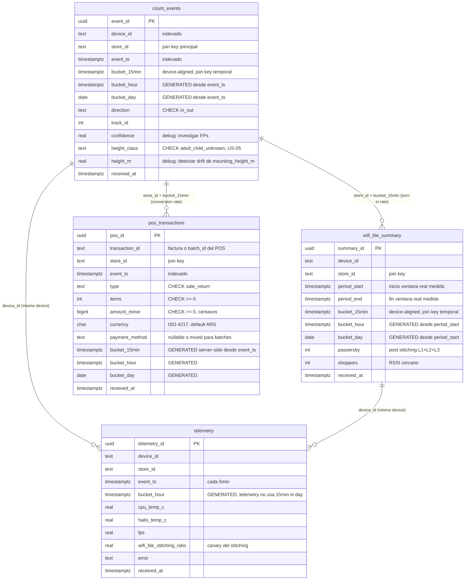
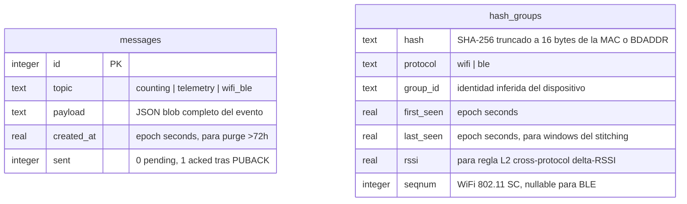

# Schema de la base de datos

Modelo ER de las dos databases del sistema:

1. **Postgres (RDS, cloud)** — 4 tablas raw + vistas derivadas
2. **SQLite (device, local)** — 2 tablas para outbox MQTT y stitching state

DDL fuente:
- Postgres: [`infra/sql/bootstrap.sql`](../infra/sql/bootstrap.sql)
- SQLite outbox: [`src/mqtt/buffer.py`](../src/mqtt/buffer.py) `_ensure_db()`
- SQLite stitching: [`src/wifi_ble/dedup.py`](../src/wifi_ble/dedup.py) `_ensure_db()`

Snapshot del 2026-05-18 post-cleanup del schema (drop de columnas dead, bucket
columns uniformizadas, `pos_transactions` agregada para T9.11 / US-06).

---

# Parte 1 — Postgres (RDS, cloud)

## Diagrama ER



## Modelo de joins

**No hay foreign keys formales** — `store_id` y `device_id` son `TEXT` libres.
Esto es por diseño: el sistema no tiene una tabla `stores` ni `devices` (PoC
con 1-3 locales) y agregarlas sería over-engineering. Los joins son por
**convención de naming**:

- **`store_id`**: presente en las 4 tablas. Mismo string en todos lados (ej.
  `ar-recoleta`). Es el join key principal para cualquier reporte by-store.
- **`device_id`**: presente solo en las 3 tablas IoT (counter, wifi/ble,
  telemetry). El POS no tiene device_id (viene de sistema externo). Convención:
  `<store_id>-cam-<n>` — `store_id` se infiere en Lambda con `_infer_store_id()`.
- **`bucket_15min`**: presente en `count_events`, `wifi_ble_summary` y
  `pos_transactions`. Mismo TIMESTAMPTZ alineado a múltiplos de 15 min del
  epoch UTC en todas las tablas → joins temporales sin `date_trunc`.

### Modelo de buckets

Tres granularidades soportadas vía columnas dedicadas para que Grafana queries
no necesiten `date_trunc`:

| Columna | Tipo | Origen |
|---|---|---|
| `bucket_15min` | TIMESTAMPTZ | Device-aligned en count_events/wifi_ble (lo manda el device pre-calculado desde `analytics.bucket_seconds`). Server-derived GENERATED en pos_transactions (el POS no conoce el shadow). |
| `bucket_hour` | TIMESTAMPTZ | GENERATED ALWAYS AS STORED — `date_trunc('hour', event_ts)` en todas las tablas. |
| `bucket_day` | DATE | GENERATED ALWAYS AS STORED — `date_trunc('day', event_ts)::date` en todas las tablas excepto telemetry (no aplica naturalmente a samples de 5min). |

## Vistas derivadas

```
counter (count_events)                  POS (pos_transactions)
  |                                       |
  +- counting_by_bucket   (15min)         +- (sin vista propia, agregado
  +- counting_hourly                      |   directo en conversion_rate)
  +- counting_daily       (+breakdown adult/child)
            |
            |       wifi_ble_summary
            |         |
            |         +- wifi_ble_store_traffic (MAX multi-cam dedup)
            |              |
            +--------------+-- turn_in_rate_by_bucket     -> US-04
            |
            +------ pos_transactions ----- conversion_rate_by_store  (15min)  -> US-06
                                           conversion_rate_hourly
                                           conversion_rate_daily
```

| Vista | Granularidad | Cierra | Notas |
|---|---|---|---|
| `counting_by_bucket` | 15min | --- | Ins/outs/net por store + bucket |
| `counting_hourly` | 1h | --- | Rollup desde `bucket_hour` |
| `counting_daily` | 1d | US-05 | Incluye breakdown `ins_adult` / `ins_child` |
| `wifi_ble_store_traffic` | 15min | --- | MAX (no SUM) por store, multi-cam dedup |
| `turn_in_rate_by_bucket` | 15min | US-04 | `ins / passersby` y `ins / shoppers` |
| `conversion_rate_by_store` | 15min | US-06 | `sales / visits` + amounts net/gross |
| `conversion_rate_hourly` | 1h | US-06 | Rollup |
| `conversion_rate_daily` | 1d | US-06 | Rollup |

## Idempotencia (UNIQUE constraints)

| Tabla | Constraint | Caso de uso |
|---|---|---|
| `count_events` | `(device_id, event_ts, track_id, direction)` | Replay del buffer SQLite del device cuando reconecta |
| `wifi_ble_summary` | `(device_id, period_start, period_end)` | Retry del WifiBlePublisher cada 15min |
| `telemetry` | `(device_id, event_ts)` | Retry de IoT Topic Rule |
| `pos_transactions` | `(store_id, transaction_id)` | Retry del POS o re-envío del batch |

Todas las Lambdas usan `INSERT ... ON CONFLICT DO NOTHING`.

## Usuarios IAM auth (least privilege)

| User Postgres | Lambda que lo usa | Grants |
|---|---|---|
| `lambda_writer` | `persist_event` (IoT → counter + wifi/ble + telemetry) | `INSERT, SELECT` sobre `count_events`, `wifi_ble_summary`, `telemetry` |
| `lambda_pos_writer` | `ingest_pos_transaction` (API Gateway → POS) | `INSERT, SELECT` sobre `pos_transactions` |

Ambos usuarios tienen `rds_iam` GRANT (auth IAM sin password). Los tokens
duran ~15min, las Lambdas los regeneran transparentemente via
`rds.generate_db_auth_token`.

## Index strategy

Por tabla, además de los PKs y UNIQUE constraints implícitos:

- **count_events**: `(store_id, event_ts DESC)`, `(device_id, event_ts DESC)`,
  `(store_id, bucket_15min DESC)`, `(store_id, bucket_day DESC)`
- **wifi_ble_summary**: `(store_id, bucket_15min DESC)`, `(store_id, bucket_day DESC)`
- **telemetry**: `(device_id, event_ts DESC)`, `(device_id, bucket_hour DESC)`
- **pos_transactions**: `(store_id, bucket_15min DESC)`, `(store_id, bucket_day DESC)`

Todos `DESC` porque las queries típicas de Grafana son "últimas N horas/días".

## Database "grafana" (separada)

Grafana guarda su state interno (users, dashboards, sessions, datasources) en
una database separada `grafana` del mismo cluster RDS. Owner =
`people_counter` (master user) para que Grafana pueda crear/modificar sus
tablas en el primer boot. No interactúa con las tablas de eventos arriba.

---

# Parte 2 — SQLite (device, local)

Cada device corre con dos archivos SQLite independientes en
`/var/lib/people-counter/`:

- `mqtt_buffer.sqlite` — outbox de mensajes pendientes de publish a IoT Core
- `wifi_ble_dedup.sqlite` — state del stitching local (hash groups,
  seqnums, RSSI windows)

Son **independientes entre sí** (no hay joins ni FKs cross-DB) y son
**locales al device** — nunca se sincronizan al cloud. La rotación es
cargo del device: el buffer purga >72h, el dedup hace `reset_daily()`.

## Diagrama ER (SQLite local)



**No hay relación entre las dos tablas** — viven en archivos sqlite distintos
y tienen ciclos de vida distintos. Aparecen en el mismo diagrama solo por
documentación.

## `messages` — outbox MQTT (`src/mqtt/buffer.py`)

Cola persistente FIFO para sobrevivir reconexiones de internet. El cliente
MQTT marca `sent=1` solo después del PUBACK QoS-1 — si el device crashea
entre publish y PUBACK, el mensaje queda como `sent=0` y se reintenta en el
próximo reconnect.

| Columna | Tipo | Notas |
|---|---|---|
| `id` | INTEGER PK AUTOINCREMENT | Orden cronológico implícito |
| `topic` | TEXT | `counting`, `telemetry`, o `wifi_ble` |
| `payload` | TEXT | `json.dumps(envelope)` — ver [api-contracts.md](api-contracts.md) para el shape |
| `created_at` | REAL | epoch seconds, para purge >72h |
| `sent` | INTEGER | 0 = pendiente, 1 = acked |

**Indexes**:
- `idx_sent_id (sent, id)` — `get_pending()` escanea `sent=0` ordenado por id
- `idx_created_at (created_at)` — `purge_old()` borra rows con `created_at < cutoff`

**PRAGMA**: WAL mode (readers no bloquean writers, mejor resilencia a
crashes), `synchronous=NORMAL` (balance entre durabilidad y throughput).

**Capacity**: el cap del backlog se mantiene por purge >72h (con vacuum diario
adicional). En 72h offline un device típico acumula ~2-5k mensajes — cabe
holgado.

## `hash_groups` — stitching state (`src/wifi_ble/dedup.py`)

State persistente del dedup L1+L2+L3 con stitching para combatir MAC
randomization. Una fila por `(hash, protocol)`; el `group_id` es la
agrupación de identidad inferida por las 3 reglas.

| Columna | Tipo | Notas |
|---|---|---|
| `hash` | TEXT | Parte del PK. SHA-256 truncado a 16 bytes (nunca MAC cruda) |
| `protocol` | TEXT | Parte del PK. `wifi` o `ble` |
| `group_id` | TEXT | UUID del grupo. Múltiples (hash, protocol) comparten group_id si las reglas los mergearon |
| `first_seen` | REAL | epoch seconds — primer aparición del hash |
| `last_seen` | REAL | epoch seconds — última observación. Drives las windows (2s cross-protocol, 30s seqnum, 15min BLE anchoring) |
| `rssi` | REAL | RSSI de la última observación. Regla L2 chequea ΔRSSI ≤ 5 dBm |
| `seqnum` | INTEGER | 802.11 sequence number (12 bits, del header `dot11.SC >> 4`). NULL para BLE. Regla seqnum continuity chequea Δseqnum ≤ 100 mod 4096 |

**PK compuesto**: `(hash, protocol)` — el mismo hash en protocolos distintos
es entrada separada (un device puede emitir hashes WiFi y BLE diferentes
pero pertenece al mismo `group_id`).

**Indexes**:
- `idx_hash_groups_group (group_id)` — `get_stitching_ratio()` cuenta DISTINCT groups
- `idx_hash_groups_last_seen (last_seen)` — `reset_daily()` purga rows viejas

**Rotación**: `reset_daily()` borra rows con `last_seen` >24h. Llamado desde
el supervisor del wifi/ble service al cruzar medianoche. Previene que un MAC
quemado siga matcheando para siempre + limpia el disco.

**Privacy critical**: este archivo es el ÚNICO lugar que guarda el seqnum y
las marcas temporales fine-grained. Nunca se publica por MQTT — el publisher
emite solo el count agregado de `DISTINCT group_id` (`passersby`, `shoppers`).

## ¿Algo que limpiar acá?

**No**. Ambos schemas son lean:
- `messages` tiene 5 columnas, todas usadas en el lifecycle
  enqueue → get_pending → mark_sent → purge_old.
- `hash_groups` tiene 7 columnas, cada una hace match con una regla del
  stitching (L1 seqnum, L2 cross-protocol, L3 BLE anchoring) o con la
  rotación diaria.

El cleanup del payload server-side (drop de scaling_factor, total_in, etc.)
no afecta al SQLite local: `messages.payload` es JSON blob — los campos
extra que el código viejo escribe se ignoran silenciosamente cuando el
Lambda los procesa con `data.get()`. **No requiere wipe del buffer al
deployar el código nuevo**.
