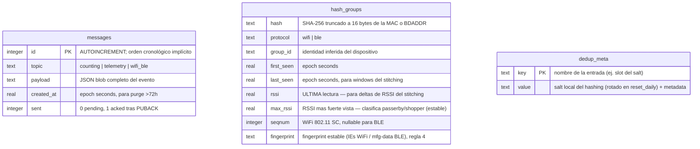

# Schema de la base de datos

Modelo ER de las dos databases del sistema:

1. **Postgres (RDS, cloud)** — 4 tablas raw + 3 de dimensiones (`sites` /
   `devices` / `holidays`) + capa de rollup incremental + vistas derivadas
2. **SQLite (device, local)** — 3 tablas en 2 archivos (`messages` para el
   outbox MQTT; `hash_groups` + `dedup_meta` para el stitching state)

DDL fuente:
- Postgres: [`infra/sql/bootstrap.sql`](../infra/sql/bootstrap.sql)
- SQLite outbox: [`src/mqtt/buffer.py`](../src/mqtt/buffer.py) `_ensure_db()`
- SQLite stitching: [`src/wifi_ble/dedup.py`](../src/wifi_ble/dedup.py) `_ensure_db()`

Snapshot del 2026-05-26 post-refactor de categorización server-side:

- `count_events.height_class` dropeada — categorización ahora vive en la
  función SQL `height_class(REAL)`, aplicada en las vistas.
- `wifi_ble_summary` reemplazada por `wifi_ble_events` (un evento per-device
  por ventana, con `visitor_hash` post-stitching local y RSSI crudo).
  Categorización passerby/shopper en función SQL `rssi_class(INT)`.

Estos cambios (drop de `height_class`, `wifi_ble_events`, restore de vistas
post-CASCADE) ya están consolidados en
[`infra/sql/bootstrap.sql`](../infra/sql/bootstrap.sql) — las migraciones
incrementales 2026-05-2x que los introdujeron se squashearon ahí (ver el
header de bootstrap.sql).

Revisión 2026-06-06: los diagramas ER se sincronizaron con el DDL canónico —
`telemetry` ahora lista las ~30 columnas reales (incl. health del dashboard ⑤),
se sumaron las dimensiones `sites`/`devices`/`holidays` con la FK `devices →
sites`, y el diagrama SQLite incorpora `dedup_meta` (salt local).

---

# Parte 1 — Postgres (RDS, cloud)

## Diagrama ER

```mermaid
erDiagram
    count_events {
        uuid        event_id        PK "gen_random_uuid()"
        text        device_id       "indexado; infiere store_id"
        text        store_id        "join key principal"
        timestamptz event_ts        "instante del cruce (indexado)"
        timestamptz bucket_15min    "GENERATED desde event_ts (server-side)"
        timestamptz bucket_hour     "GENERATED desde event_ts"
        date        bucket_day      "GENERATED desde event_ts"
        text        direction       "CHECK in_out"
        int         track_id        "id del track (parte del UNIQUE de idempotencia)"
        real        confidence      "score del detector; debug de FPs"
        real        height_m        "medición cruda; categorización vía SQL height_class()"
        timestamptz received_at     "ingreso a RDS (default now); watermark del rollup"
    }

    wifi_ble_events {
        uuid        event_id        PK "gen_random_uuid()"
        text        device_id       "indexado; infiere store_id"
        text        store_id        "join key"
        bytea       visitor_hash    "16 bytes; group_id post-stitching local (opaco)"
        text        protocol        "CHECK wifi_ble"
        int         rssi_max        "dBm crudo; categorización vía SQL rssi_class()"
        timestamptz first_seen_ts   "MIN sobre miembros del group"
        timestamptz last_seen_ts    "MAX sobre miembros (puede caer en la ventana)"
        timestamptz period_start    "inicio ventana de emisión del device"
        timestamptz period_end      "fin ventana de emisión"
        timestamptz bucket_15min    "GENERATED desde last_seen_ts (server-side)"
        timestamptz bucket_hour     "GENERATED desde last_seen_ts"
        date        bucket_day      "GENERATED desde last_seen_ts"
        timestamptz received_at     "ingreso a RDS (default now); watermark del rollup"
    }

    telemetry {
        uuid        telemetry_id    PK "gen_random_uuid()"
        text        device_id       "indexado"
        text        store_id        "join key"
        timestamptz event_ts        "muestra cada 5min"
        timestamptz bucket_hour     "GENERATED, telemetry no usa 15min ni day"
        real        uptime_s        "segundos desde el boot del proceso"
        real        cpu_temp_c       "temperatura CPU (°C)"
        real        hailo_temp_c     "temperatura del Hailo-8L (°C)"
        int         disk_free_mb     "espacio libre en disco (MB)"
        int         mem_available_mb "RAM disponible (MB)"
        int         throttled_flags  "bitmask vcgencmd get_throttled (0=sano; undervolt/throttle/soft-temp + sticky)"
        int         arm_clock_mhz    "frecuencia ARM actual (MHz); cae bajo 2400 al throttlear"
        int         fan_rpm          "RPM del fan del Active Cooler (0 con temp alta = fan clavado)"
        real        power_w          "consumo total output-side del PMIC (placa+Hailo+cámaras)"
        real        ext5v_v          "tensión de entrada 5V (sag = fuente/cable flojo)"
        boolean     fs_readonly      "root fs montado read-only (microSD fallando → escrituras muertas)"
        int         service_restarts "NRestarts del service (crash-loop si crece)"
        boolean     clock_synchronized "reloj sincronizado por NTP (false sostenido = timestamps en riesgo)"
        boolean     cam_left_ok      "cámara izq del par estéreo viva (false = SensorTimestamp congelado / cable CSI)"
        boolean     cam_right_ok     "cámara der del par estéreo viva (idem)"
        real        fps              "frames por segundo del pipeline"
        real        frame_latency_p50_ms "latencia por frame p50 (ms)"
        real        frame_latency_p95_ms "latencia por frame p95 (ms)"
        real        detection_rate_per_min "detecciones por minuto"
        int         tracker_confirmed_count "tracks CONFIRMED activos"
        int         tracker_pending_count   "tracks PENDING activos"
        int         total_in         "ingresos acumulados del día"
        int         total_out        "egresos acumulados del día"
        bool        mqtt_connected   "estado de conexión al broker"
        int         mqtt_disconnect_count "desconexiones acumuladas"
        real        seconds_since_last_reconnect "seg desde la última reconexión"
        int         buffer_backlog_messages  "backlog del outbox SQLite (unsent)"
        bool        wifi_probe_ok    "salud del probe WiFi"
        bool        ble_scanner_ok   "salud del scanner BLE"
        real        wifi_probe_rate_per_min "probes/min (canary: 0 con probe_ok=true = nexmon mudo)"
        real        wifi_ble_stitching_ratio "canary del stitching wifi/ble"
        real        track_stitching_ratio    "canary fragmentación del tracker"
        int         death_emit_count         "capa 3 rescue: death-emits firing"
        int         ghost_adoption_count     "capa 1 rescue: ID adoptions"
        timestamptz last_shadow_apply_ts     "canary Device Shadow: último delta aplicado, NULL si nunca hubo push"
        text        error            "mando de error del payload (nullable)"
        text        schedule_error_detail "detalle largo del error (nullable)"
        timestamptz received_at      "ingreso a RDS (default now)"
    }

    pos_transactions {
        uuid        pos_id          PK "gen_random_uuid()"
        text        transaction_id  "factura o batch_id del POS"
        text        store_id        "join key"
        timestamptz event_ts        "instante de la transacción (indexado)"
        text        type            "CHECK sale_return"
        int         items           "items vendidos/devueltos (CHECK >= 0)"
        bigint      amount_minor    "monto en centavos (CHECK >= 0)"
        char        currency        "ISO 4217, default ARS"
        text        payment_method  "nullable o mixed para batches"
        timestamptz bucket_15min    "GENERATED server-side desde event_ts"
        timestamptz bucket_hour     "GENERATED"
        date        bucket_day      "GENERATED"
        timestamptz received_at     "ingreso a RDS (default now); watermark del rollup"
    }

    sites {
        text        store_id        PK "matchea store_id de los hechos"
        text        store_name      "human-readable para dashboards"
        float       latitude        "DOUBLE PRECISION, geomap"
        float       longitude       "DOUBLE PRECISION, geomap"
        text        timezone        "IANA; base del bucketing local"
        numeric     sales_area_m2   "superficie de venta → ventas/m2"
        text        status          "CHECK operational/temp_closed/perm_closed"
        timestamptz created_at      "alta del registro"
        timestamptz updated_at      "última modificación"
    }

    devices {
        text        device_id       PK "matchea device_id de los hechos"
        text        store_id        FK "→ sites.store_id (ON UPDATE CASCADE)"
        text        cam_label       "etiqueta de la cámara (ej. puerta principal)"
        text        firmware_version "versión de firmware del device"
        timestamptz installed_at    "fecha de instalación"
        timestamptz created_at      "alta del registro"
        timestamptz updated_at      "última modificación"
    }

    holidays {
        date        holiday_date    PK "fecha del feriado"
        text        name            "nombre del feriado"
        text        type            "CHECK nacional/puente"
    }

    sites            ||--o{ devices          : "FK device → site (única FK del schema)"
    sites            ||--o{ count_events     : "store_id (LEFT JOIN, sin FK)"
    sites            ||--o{ wifi_ble_events  : "store_id (LEFT JOIN, sin FK)"
    sites            ||--o{ pos_transactions : "store_id (LEFT JOIN, sin FK)"
    sites            ||--o{ telemetry        : "store_id (LEFT JOIN, sin FK)"
    count_events     ||--o{ wifi_ble_events   : "store_id + bucket_15min (turn-in rate)"
    count_events     ||--o{ pos_transactions  : "store_id + bucket_15min (conversion rate)"
    count_events     ||--o{ telemetry         : "device_id (mismo device)"
    wifi_ble_events  ||--o{ telemetry         : "device_id (mismo device)"
```



> **Nota sobre las relaciones**: la única **FK real** del schema es `devices →
> sites`. El resto de las líneas (`sites`→hechos y los joins entre hechos) son
> **convención de naming** (`store_id` / `device_id` / `bucket_15min` como
> TEXT/TIMESTAMPTZ libres) — Grafana hace LEFT JOIN, sin constraint, para que la
> Lambda no falle al escribir un hecho de un site aún no registrado (ver
> [Modelo de joins](#modelo-de-joins)).

## Categorización server-side via funciones SQL

Patrón aplicado en mayo 2026 para centralizar los thresholds que antes
vivían en el config local del device (y por ende drifteaban entre devices
de la flota): el device persiste sólo la **medición cruda** (`height_m`,
`rssi_max`), y la categorización se aplica en las vistas vía funciones
SQL `IMMUTABLE`.

| Función | Input | Output | Thresholds |
|---|---|---|---|
| `height_class(REAL)` | metros | `'adult'` / `'child'` / `'unknown'` | `< 1.55` → child, NULL → unknown, else adult |
| `rssi_class(INT)` | dBm | `'shopper'` / `'passerby'` / `'weak'` / `'unknown'` | `>= -55` → shopper, `>= -75` → passerby, NULL → unknown, else weak |

**Single source of truth**: modificar el threshold = `CREATE OR REPLACE
FUNCTION` y se aplica retroactivo a todo el histórico + a todas las
vistas downstream. What-if analysis directo en BI sin re-procesar el
device. Granted EXECUTE a `lambda_query_reader` y `readonly_external`.

**Invariante shoppers ⊆ passersby**: por convención el conteo de
`passersby` en las vistas usa el filtro `rssi_class(rssi_max) IN
('passerby', 'shopper')` — un shopper también cuenta como passerby. El
funnel queda internamente consistente bucket-por-bucket.

## Modelo de joins

**Las tablas de hechos no tienen foreign keys hacia las dimensiones** —
`store_id` y `device_id` son `TEXT` libres en `count_events`,
`wifi_ble_events`, `telemetry`, `pos_transactions`. Es deliberado: la Lambda
escribe hechos y NO debe fallar si un site todavía no se registró; Grafana hace
LEFT JOIN. Los joins de hechos son por **convención de naming**.

Sí existen dos tablas de **dimensiones** (agregadas 2026-05-22, sembradas en
provisioning vía `scripts/provision.py` / `scripts/reset_dedup.py`... ver
`provision.py create --latitude/--longitude`):

- **`sites`** (PK `store_id`): `store_name`, `latitude`/`longitude` (DOUBLE
  PRECISION, para el geomap de Grafana), `timezone` (IANA — base del bucketing
  local de la capa de rollup, ver abajo), `sales_area_m2` (NUMERIC,
  superficie de venta en m² → métrica ventas/m²), `status` (TEXT con `CHECK IN
  ('operational', 'temp_closed', 'perm_closed')`, default `operational`; NO
  afecta la ingesta —es solo un filtro de visualización: Grafana muestra solo
  `operational`).
- **`devices`** (PK `device_id`, FK → `sites.store_id`): `cam_label`,
  `firmware_version`, `installed_at`.

También hay una tabla de referencia **`holidays`** (PK `holiday_date`):
`name`, `type` (`CHECK IN ('nacional', 'puente')`). No se dropea en el reset
(seedeada inline en `bootstrap.sql` con `ON CONFLICT DO UPDATE`). Grafana la
pinta como annotations (líneas verticales) sobre las series temporales para
contextualizar picos/valles.

Sirven para el geomap, los dropdowns de filtro de Grafana (template vars desde
una tabla chica en vez de `SELECT DISTINCT` sobre los hechos) y labels
human-readable. La única FK del schema es `devices → sites`. DDL en
`infra/sql/bootstrap.sql` (fuera del bloque de DROP — no se borran al
re-bootstrap). Los joins:

- **`store_id`**: presente en las 4 tablas. Mismo string en todos lados (ej.
  `ar-recoleta`). Es el join key principal para cualquier reporte by-store.
- **`device_id`**: presente solo en las 3 tablas IoT (counter, wifi/ble,
  telemetry). El POS no tiene device_id (viene de sistema externo). Convención:
  `<store_id>-cam-<n>` — `store_id` se infiere en Lambda con `_infer_store_id()`.
- **`bucket_15min`**: presente en `count_events`, `wifi_ble_events` y
  `pos_transactions`. Mismo TIMESTAMPTZ alineado a múltiplos de 15 min del
  epoch UTC en todas las tablas → joins temporales sin `date_trunc`.

### Modelo de buckets

Tres granularidades soportadas vía columnas dedicadas para que Grafana queries
no necesiten `date_trunc`:

| Columna | Tipo | Origen |
|---|---|---|
| `bucket_15min` | TIMESTAMPTZ | **Server-derived `GENERATED ALWAYS AS STORED`** desde `event_ts` (count_events, pos_transactions) o `last_seen_ts` (wifi_ble_events). El device manda timestamps crudos — desacopla device ↔ schema. Migrar a bucket de otro tamaño = `ALTER COLUMN` en RDS, sin tocar device/MQTT/Lambda. En `wifi_ble_events` el bucket se deriva de `last_seen_ts` (no `period_start`) para que un visitor presente en varias ventanas caiga naturalmente en el bucket más reciente al rollup; `COUNT(DISTINCT visitor_hash)` dedupa cross-window. |
| `bucket_hour` | TIMESTAMPTZ | GENERATED ALWAYS AS STORED — `date_trunc('hour', event_ts)` en todas las tablas. |
| `bucket_day` | DATE | GENERATED ALWAYS AS STORED — `date_trunc('day', event_ts)::date` en todas las tablas excepto telemetry (no aplica naturalmente a samples de 5min). |

## Capa de rollup incremental (speed-layer + batch-layer)

Las tablas **raw** (`count_events`, `wifi_ble_events`, `pos_transactions`) son
la **fuente de verdad**. Sobre ellas hay una capa de rollup pre-computada que
desacopla el costo de las queries de Grafana del volumen total acumulado:

```
raw (count_events / wifi_ble_events / pos_transactions)   ← fuente de verdad
        │  refresh_rollups()  (plpgsql, INCREMENTAL por watermark, pg_cron c/5min)
        ▼
10 tablas base rollup_*  (buckets CERRADOS, pre-agregados)
        │  UNION ALL
        ▼  + live-tail del bucket ABIERTO (lectura directa del raw, ≤5s de lag)
VISTAS  *_by_bucket_*  (lo que consumen Grafana / Lambda / readonly_external)
```

### Las 10 tablas base `rollup_*`

Una tabla por `(fact × granularidad)`. Tipos `bigint`/`numeric` para que el
`UNION ALL` con el live-tail no choque:

| Tabla | Grano | Columnas de métrica |
|---|---|---|
| `rollup_counting_15min` / `_hour` / `_day` | 15min / 1h / 1d | `ins`, `outs`, `net` + breakdown `ins_adult`/`ins_child`/`ins_unknown` + `outs_*` |
| `rollup_wifi_ble_15min` / `_hour` / `_day` | 15min / 1h / 1d | `passersby`, `shoppers`, `visitors` |
| `rollup_wifi_engagement_day` | 1d | `windows_bucket` (`'1'`/`'2'`/`'3-5'`/`'6+'`) + `visitors` |
| `rollup_pos_15min` / `_hour` / `_day` | 15min / 1h / 1d | `sales`, `returns`, `transactions`, `items_*`, `amount_minor_*`, `net_amount_minor`, `currency` |

(10 tablas: 3 counting + 3 wifi_ble + 1 wifi_engagement_day + 3 pos.)

### `refresh_rollups()` + watermark

`refresh_rollups()` (PROCEDURE plpgsql) recomputa **incrementalmente**: lee el
watermark (`received_at`) de la tabla `rollup_state` (1 fila por fuente:
`counting`, `wifi_ble`, `pos`; arranca en `'-infinity'` → primer `CALL` hace
backfill total), agrega SOLO los buckets con datos nuevos desde el watermark
(`ON CONFLICT (store_id, bucket) DO UPDATE` upsertea el bucket recomputado) y
avanza el watermark. → O(reciente), escala con la flota, sin tocar el hot-path
de ingesta. Lo corre **pg_cron cada 5 min**. Tras un deploy fresco:
`CALL refresh_rollups()` (backfill) + agendar el cron.

### Bucketing local-as-UTC por tienda

A diferencia de las columnas `GENERATED` de las tablas raw (que bucketean en
**UTC**), la capa de rollup bucketea en la **zona horaria de cada tienda**
(`sites.timezone`) vía los helpers SQL `lday(ts,tz)` / `lhour(ts,tz)` /
`l15(ts,tz)` (`STABLE`, `AT TIME ZONE`). El `bucket_hour`/`bucket_15min` se
guarda como **wall-clock-local representado como UTC** → cada tienda agrupa en
su hora local (multi-país) sin necesitar una columna de offset.

### Vistas = rollup (cerrado) UNION ALL live-tail (abierto)

Cada vista base **NO lee el raw directo**: lee `rollup_*` (buckets ya cerrados,
`r.bucket <> bucket-local-actual`) `UNION ALL` el raw **sólo para el bucket
abierto** (live-tail, `event_ts`/`last_seen_ts` dentro del día local actual,
acotado a `[now()-2d, now()+1d]` para que el índice prune). El lag del bucket
abierto es ≤5s (lo que tarda el raw en estar consultable). Las vistas derivadas
(turn_in, conversion, occupancy, visit_duration, etc.) leen estas por nombre →
heredan el patrón rollup+live-tail y el bucketing tz-correcto sin cambios.

### Migración de histórico agregado (direct-to-rollup)

El histórico **agregado** (sin eventos individuales) de un sistema previo se
inserta **directo en las tablas base `rollup_*`** (saltea el raw, que no existe
para ese período). Entregables:
[`infra/sql/migrate_historical_rollups.example.sql`](../infra/sql/migrate_historical_rollups.example.sql)
(template staging→rollups: bucket local-as-UTC, rango de estatura desconocido →
`unknown`, `ON CONFLICT` idempotente) y
[`scripts/migrate_historical.py`](../scripts/migrate_historical.py) (loader
CSV→staging por **lotes con commits incrementales**, para no saturar RDS — ver
[`cloud_dr.md`](cloud_dr.md) §carga masiva).

## Vistas derivadas

Producto cartesiano `<métrica>_by_bucket_<grano>` sobre 3 granularidades
(`15min`, `hour`, `day`) y vistas unificadas consumidas por la Lambda
`query_aggregates`. Cada vista = `rollup_*` (buckets cerrados) `UNION ALL`
live-tail del raw (bucket abierto) — ver la capa de rollup arriba. Definiciones
completas en [`infra/sql/bootstrap.sql`](../infra/sql/bootstrap.sql) (sección de
vistas).

```
counter (count_events)                  POS (pos_transactions)
  |  height_class(height_m) FILTER       |
  +- counting_by_bucket_{15min,hour,day}  +- pos_by_bucket_{15min,hour,day}
            |     (+ breakdown adult/child via SQL function)
            |
            |   wifi_ble (wifi_ble_events)
            |     |  rssi_class(rssi_max) FILTER + COUNT(DISTINCT visitor_hash)
            |     +- wifi_ble_by_bucket_{15min,hour,day}
            |          |
            +----------+-- turn_in_rate_by_bucket_{15min,hour,day}    -> US-04
            |
            +- conversion_by_bucket_{15min,hour,day}                  -> US-06
            +- occupancy_by_bucket_{15min,hour,day} (cumsum por día)
            +- visit_duration_by_bucket_{hour,day}  (Ley de Little)
            +- wifi_engagement_by_bucket_day        (visitors por #ventanas)
            +- revenue_per_visitor_by_bucket_{hour,day}
            +- sales_per_sqm_by_bucket_{hour,day}   (usa sites.sales_area_m2)

           ↓ COMBINADAS (Lambda query_aggregates consume estas)
       metrics_unified_by_bucket_{15min,hour,day}  (FULL OUTER JOIN counting+wifi_ble+pos)
       data_freshness_by_store                     (último received_at cross-fact)
```

| Vista | Granularidad | Cierra | Notas |
|---|---|---|---|
| `counting_by_bucket_*` | 15min/1h/1d | US-05 | Ins/outs/net + breakdown `ins_adult` / `ins_child` / `ins_unknown` via `height_class(height_m)` |
| `wifi_ble_by_bucket_*` | 15min/1h/1d | --- | `COUNT(DISTINCT visitor_hash)` + filter `rssi_class(rssi_max) IN ('passerby','shopper')` → dedupa cross-window |
| `turn_in_rate_by_bucket_*` | 15min/1h/1d | US-04 | `ins / passersby` y `ins / shoppers` |
| `conversion_by_bucket_*` | 15min/1h/1d | US-06 | `sales / visits` + amounts net/gross |
| `occupancy_by_bucket_*` | 15min/1h/1d | --- | Cumsum `ins - outs` window-partitioned por día |
| `visit_duration_by_bucket_{hour,day}` | 1h/1d | --- | Ley de Little: `avg_occupancy / arrivals` en minutos |
| `wifi_engagement_by_bucket_day` | 1d | --- | Visitors WiFi/BLE segmentados por nº de ventanas presentes (`'1'` / `'2'` / `'3-5'` / `'6+'`) → proxy de dwell time |
| `revenue_per_visitor_by_bucket_{hour,day}` | 1h/1d | --- | `net_amount_minor / ins` (ticket promedio por visitante) |
| `sales_per_sqm_by_bucket_{hour,day}` | 1h/1d | --- | `net_amount_minor / sites.sales_area_m2` (ventas por m² de superficie) |
| `metrics_unified_by_bucket_*` | 15min/1h/1d | US-09 | FULL OUTER JOIN counting + wifi_ble + pos. Consumida por Lambda `query_aggregates` |
| `data_freshness_by_store` | --- | US-08 | Último `received_at` cross-fact por sucursal |

## Idempotencia (UNIQUE constraints)

| Tabla | Constraint | Caso de uso |
|---|---|---|
| `count_events` | `(device_id, event_ts, track_id, direction)` | Replay del buffer SQLite del device cuando reconecta |
| `wifi_ble_events` | `(device_id, visitor_hash, period_start)` | Retry del WifiBlePublisher cada 15min con `ON CONFLICT DO UPDATE` (GREATEST rssi_max + last_seen_ts) |
| `telemetry` | `(device_id, event_ts)` | Retry de IoT Topic Rule |
| `pos_transactions` | `(store_id, transaction_id)` | Retry del POS o re-envío del batch |

`count_events` / `telemetry` / `pos_transactions` usan `INSERT ... ON
CONFLICT DO NOTHING`. `wifi_ble_events` usa `ON CONFLICT DO UPDATE`
refinando `rssi_max` al MAX y `last_seen_ts` al MAX — un retry del mismo
período sólo mejora la observación (cubre el caso "el publisher reintentó
porque MQTT falló mid-batch y ahora rssi_max es más fuerte").

## Usuarios IAM auth (least privilege)

| User Postgres | Lambda que lo usa | Grants |
|---|---|---|
| `lambda_writer` | `persist_event` (IoT → counter + wifi/ble + telemetry) | `INSERT, SELECT` sobre `count_events`, `wifi_ble_events`, `telemetry` |
| `lambda_pos_writer` | `ingest_pos_transaction` (API Gateway → POS) | `INSERT, SELECT` sobre `pos_transactions` |
| `lambda_query_reader` | `query_aggregates` (API GW → BI/partners) | `SELECT` sobre vistas `metrics_unified_*` + `data_freshness_by_store` + dimensiones; `EXECUTE` sobre `height_class(REAL)` y `rssi_class(INT)` |
| `readonly_external` | Partners/analistas externos (SQL directo) | `SELECT` sobre todas las vistas `*_by_bucket_*` + dimensiones; `EXECUTE` sobre las funciones de categorización. Acceso vía password (Secrets Manager), no IAM |

Ambos usuarios tienen `rds_iam` GRANT (auth IAM sin password). Los tokens
duran ~15min, las Lambdas los regeneran transparentemente via
`rds.generate_db_auth_token`.

## Index strategy

Por tabla, además de los PKs y UNIQUE constraints implícitos:

- **count_events**: `(store_id, event_ts DESC)`, `(device_id, event_ts DESC)`,
  `(store_id, bucket_15min DESC)`, `(store_id, bucket_day DESC)`
- **wifi_ble_events**: `(store_id, bucket_15min DESC)`, `(store_id, bucket_hour DESC)`, `(store_id, bucket_day DESC)`, `(store_id, bucket_day, visitor_hash)` (último para queries DISTINCT visitor diario)
- **telemetry**: `(device_id, event_ts DESC)`, `(device_id, bucket_hour DESC)`
- **pos_transactions**: `(store_id, bucket_15min DESC)`, `(store_id, bucket_day DESC)`

Todos `DESC` porque las queries típicas de Grafana son "últimas N horas/días".

## Database "grafana" (separada)

Grafana guarda su state interno (users, dashboards, sessions, datasources) en
una database separada `grafana` del mismo cluster RDS. Owner =
`people_counter` (master user) para que Grafana pueda crear/modificar sus
tablas en el primer boot. No interactúa con las tablas de eventos arriba.

---

# Parte 2 — SQLite (device, local)

Cada device corre con dos archivos SQLite independientes en
`/var/lib/people-counter/`:

- `mqtt_buffer.sqlite` — outbox de mensajes pendientes de publish a IoT Core
- `wifi_ble_dedup.sqlite` — state del stitching local (hash groups,
  seqnums, RSSI windows)

Son **independientes entre sí** (no hay joins ni FKs cross-DB) y son
**locales al device** — nunca se sincronizan al cloud. La rotación es
cargo del device: el buffer purga >72h, el dedup hace `reset_daily()`.

## Diagrama ER (SQLite local)



**No hay relación entre las tablas del diagrama** — `messages` vive en
`mqtt_buffer.sqlite`; `hash_groups` y `dedup_meta` viven juntas en
`wifi_ble_dedup.sqlite` (mismo archivo, pero sin FK entre sí: una es el state
del stitching y la otra un key-value de metadata). Aparecen en el mismo
diagrama solo por documentación.

## `messages` — outbox MQTT (`src/mqtt/buffer.py`)

Cola persistente FIFO para sobrevivir reconexiones de internet. El cliente
MQTT marca `sent=1` solo después del PUBACK QoS-1 — si el device crashea
entre publish y PUBACK, el mensaje queda como `sent=0` y se reintenta en el
próximo reconnect.

| Columna | Tipo | Notas |
|---|---|---|
| `id` | INTEGER PK AUTOINCREMENT | Orden cronológico implícito |
| `topic` | TEXT | `counting`, `telemetry`, o `wifi_ble` |
| `payload` | TEXT | `json.dumps(envelope)` — ver [api_contracts.md](api_contracts.md) para el shape |
| `created_at` | REAL | epoch seconds, para purge >72h |
| `sent` | INTEGER | 0 = pendiente, 1 = acked |

**Indexes**:
- `idx_sent_id (sent, id)` — `get_pending()` escanea `sent=0` ordenado por id
- `idx_created_at (created_at)` — `purge_old()` borra rows con `created_at < cutoff`

**PRAGMA**: WAL mode (readers no bloquean writers, mejor resilencia a
crashes), `synchronous=NORMAL` (balance entre durabilidad y throughput).

**Capacity**: el cap del backlog se mantiene por purge >72h (con vacuum diario
adicional). En 72h offline un device típico acumula ~2-5k mensajes — cabe
holgado.

## `hash_groups` — stitching state (`src/wifi_ble/dedup.py`)

State persistente del dedup con stitching para combatir MAC randomization. Una
fila por `(hash, protocol)`; el `group_id` es la agrupación de identidad
inferida por las **4 reglas** (seqnum continuity, cross-protocol L2, BLE
anchoring, fingerprint continuity — ver CLAUDE.md).

| Columna | Tipo | Notas |
|---|---|---|
| `hash` | TEXT | Parte del PK. SHA-256 truncado a 16 bytes (nunca MAC cruda) |
| `protocol` | TEXT | Parte del PK. `wifi` o `ble` |
| `group_id` | TEXT | UUID del grupo. Múltiples (hash, protocol) comparten group_id si las reglas los mergearon |
| `first_seen` | REAL | epoch seconds — primer aparición del hash |
| `last_seen` | REAL | epoch seconds — última observación. Drives las windows (2s cross-protocol, 30s seqnum, 15min BLE anchoring/fingerprint) |
| `rssi` | REAL | RSSI de la **última** observación. La usan los deltas de RSSI del stitching (quieren la señal reciente) |
| `max_rssi` | REAL | RSSI **más fuerte** vista. `get_traffic_counts` clasifica passerby/shopper sobre esta → conteo estable (un device que estuvo cerca cuenta de forma monótona, sin flapping) |
| `seqnum` | INTEGER | 802.11 sequence number (12 bits, del header `dot11.SC >> 4`). NULL para BLE. Regla seqnum continuity chequea Δseqnum ≤ 100 mod 4096 |
| `fingerprint` | TEXT | Fingerprint estable (orden de IEs + caps en WiFi; company ID + Continuity de Apple en BLE). Regla 4: re-une rotaciones que el seqnum no agarra; filtro duro en la regla 1 |

**PK compuesto**: `(hash, protocol)` — el mismo hash en protocolos distintos
es entrada separada (un device puede emitir hashes WiFi y BLE diferentes
pero pertenece al mismo `group_id`).

**Indexes**:
- `idx_hash_groups_group (group_id)` — `get_stitching_ratio()` cuenta DISTINCT groups
- `idx_hash_groups_last_seen (last_seen)` — windows del stitching
- `idx_hash_groups_fp (protocol, fingerprint)` — lookup de la regla 4

**Rotación**: `reset_daily()` hace `DELETE FROM hash_groups` (wipe completo).
Lo dispara `people-counter-reset.timer` a las 04:00 vía
`scripts/reset_dedup.py` (config-aware: resuelve el path del sqlite igual que
el pipeline). Boundary diario de privacidad + analytics; el stitching
cross-día no tiene sentido con MAC/RPA rotando igual.

**Privacy critical**: este archivo es el ÚNICO lugar que guarda el seqnum y
las marcas temporales fine-grained. Nunca se publica por MQTT — el publisher
emite solo el count agregado de `DISTINCT group_id` (`passersby`, `shoppers`).

## `dedup_meta` — metadata del dedup (`src/wifi_ble/dedup.py`)

Key-value chico en `wifi_ble_dedup.sqlite`. Su uso crítico es persistir el
**salt local** del hashing de MACs: estable durante la vida del DB (así el
mismo MAC hashea igual y el stitching funciona) y **rotado en `reset_daily()`**
junto con el wipe de `hash_groups`. Cachea el salt en memoria para no pegarle al
DB en cada `process_detection`. Sin este salt at-rest una MAC cruda sería
reversible por fuerza bruta del hash — ver la regla dura "nunca hash sin sal".

| Columna | Tipo | Notas |
|---|---|---|
| `key` | TEXT PK | Nombre de la entrada (ej. el slot del salt) |
| `value` | TEXT | Valor serializado |

## ¿Algo que limpiar acá?

**No**. Los tres schemas SQLite son lean:
- `messages` tiene 5 columnas, todas usadas en el lifecycle
  enqueue → get_pending → mark_sent → purge_old.
- `hash_groups` tiene 9 columnas, cada una sirve a una regla del stitching
  (seqnum, cross-protocol, BLE anchoring, fingerprint), a la clasificación
  passerby/shopper (`max_rssi`) o a la rotación diaria.
- `dedup_meta` tiene 2 columnas (key-value) — el mínimo para persistir el salt.

El cleanup del payload server-side (drop de scaling_factor, total_in, etc.)
no afecta al SQLite local: `messages.payload` es JSON blob — los campos
extra que el código viejo escribe se ignoran silenciosamente cuando el
Lambda los procesa con `data.get()`. **No requiere wipe del buffer al
deployar el código nuevo**.
