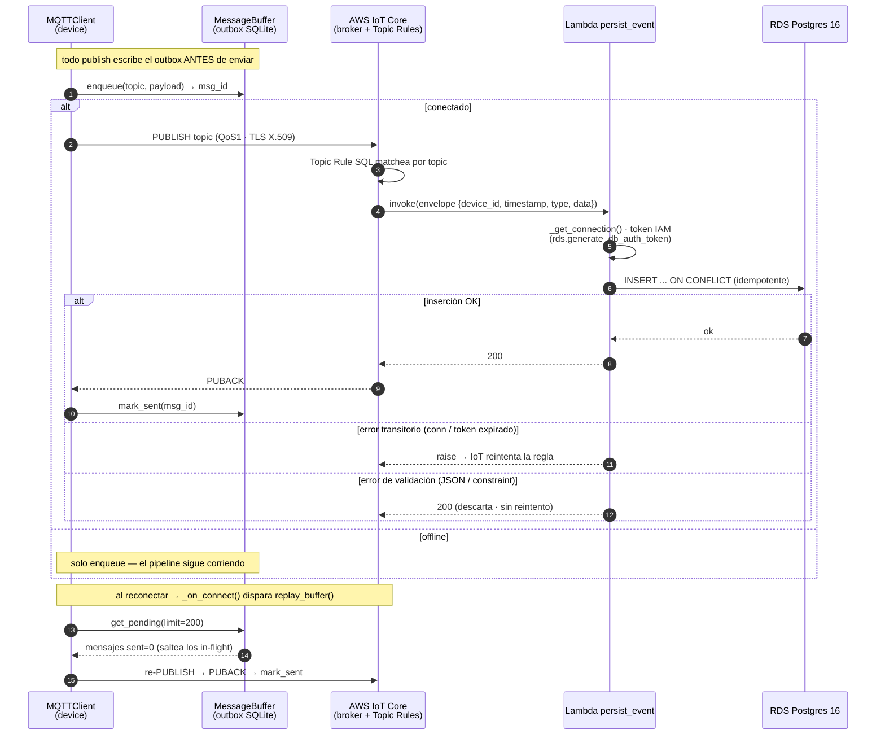
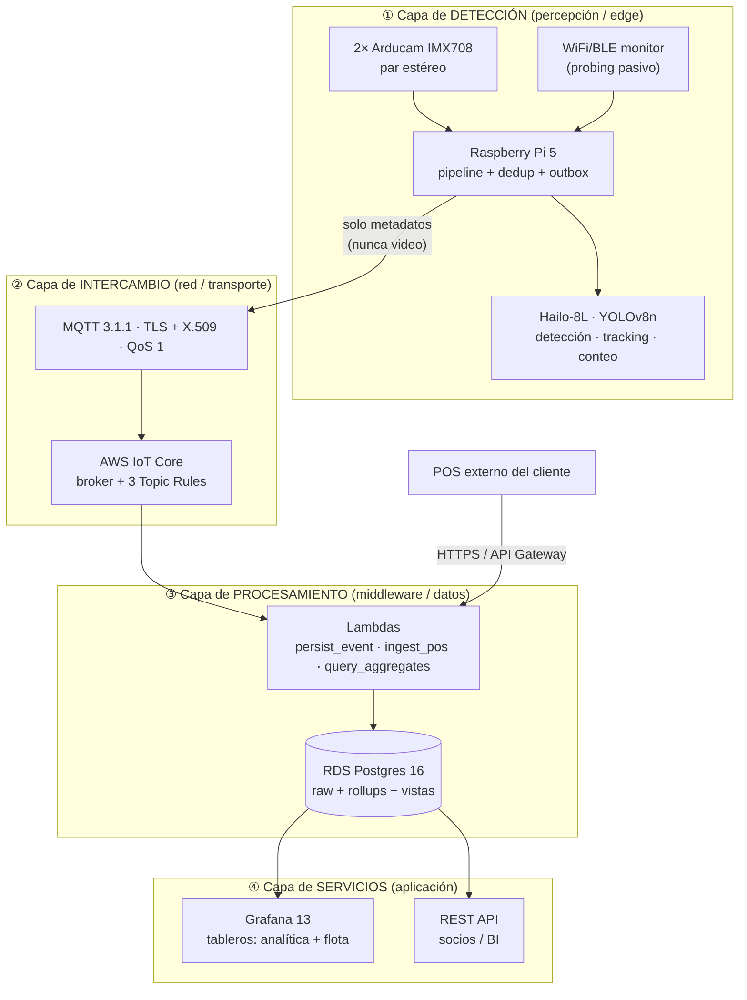
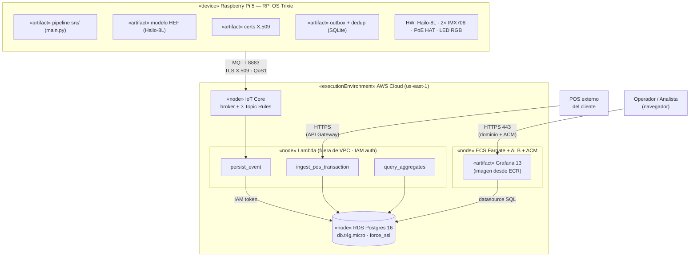
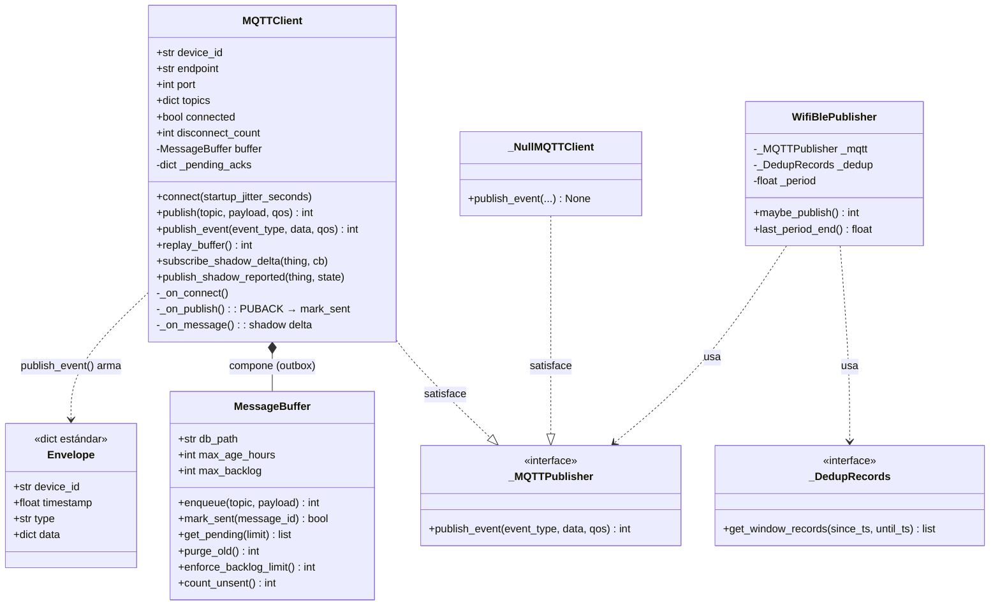
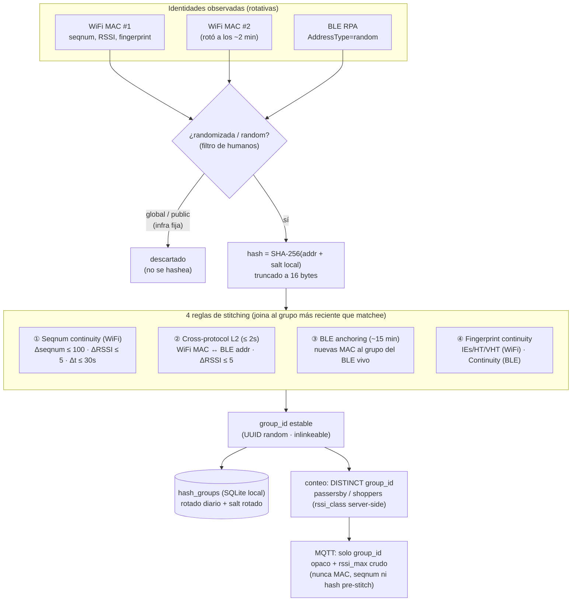

# Diagramas del TFG — fuentes Mermaid

Borradores versionados de las figuras del documento, derivados de la fuente de
verdad del repo (código + `infra/`). Sirven como **guía exacta de actores,
mensajes, clases y relaciones** para redibujarlas en Visio (o renderizarlas
directo con Mermaid).

Cada figura lista su **fuente en el repo** para trazabilidad. Si el código
cambia, actualizar acá primero y re-exportar.

> **Render**: pegar el bloque en [mermaid.live](https://mermaid.live) o usar la
> extensión Mermaid de VS Code → exportar SVG/PNG. La Figura 9 (DER) ya está en
> [`database_schema.md`](database_schema.md) y no se duplica acá.

| Fig | Título | Tipo | Fuente en el repo |
|---|---|---|---|
| 4 | Evento de conteo desde captura estéreo | Secuencia | `src/main.py`, `src/vision/*`, `src/tracking/*`, `src/mqtt/*` |
| 5 | Resumen de tráfico desde captura WiFi/BLE | Secuencia | `src/wifi_ble/{wifi_probe,ble_scan,dedup,publisher}.py` |
| 6 | Integración y entrega de flujos a la nube | Secuencia | `src/mqtt/{client,buffer}.py`, `src/cloud/persist_event.py` |
| 7 | Arquitectura general (4 capas IoT) | Flujo / bloques | `README.md §Arquitectura`, `CLAUDE.md` |
| 8 | Despliegue del sistema | Despliegue | `infra/cloudformation/people-counter.yaml`, `CLAUDE.md §Hardware` |
| 9 | DER del esquema PostgreSQL | Entidad-relación | **[`database_schema.md`](database_schema.md)** (ya existe) |
| 10 | Modelo de clases de mensajería MQTT | Clases | `src/mqtt/{client,buffer}.py`, `src/wifi_ble/publisher.py` |
| 13 | Esquema de stitching de identidad inalámbrica | Conceptual / bloques | `CLAUDE.md §Captura WiFi/BLE`, `src/wifi_ble/{dedup,fingerprint}.py` |

---

## §3.4 — Diagramas de secuencia

### Figura 4 — Generación de un evento de conteo a partir de la captura estéreo

> **Fuente**: `src/main.py` (loop principal) → `src/vision/calibration.rectify_pair`
> → `src/vision/depth` (SGBM+WLS) → `src/vision/detect.detect_persons` (Hailo) →
> `src/tracking/tracker.EuclideanTracker.update` → `src/tracking/counter.Counter`
> → `src/mqtt/client.MQTTClient.publish_event` → `src/mqtt/buffer.MessageBuffer`.

```mermaid
sequenceDiagram
    autonumber
    participant CAM as Cámaras IMX708<br/>(StereoCapture)
    participant LOOP as Pipeline<br/>(main loop)
    participant CAL as Calibración<br/>(rectify_pair)
    participant DEP as Profundidad<br/>(SGBM + WLS)
    participant DET as Detector<br/>(HailoBackend)
    participant TRK as EuclideanTracker
    participant CNT as Counter
    participant MQ as MQTTClient
    participant BUF as MessageBuffer

    loop cada frame
        LOOP->>CAM: capture()
        CAM-->>LOOP: frame_l, frame_r
        LOOP->>CAL: rectify_pair(frame_l, frame_r)
        CAL-->>LOOP: rect_l, rect_r
        LOOP->>DEP: compute_depth(rect_l, rect_r)
        DEP-->>LOOP: depth_map (fresh o cache)
        LOOP->>DET: detect_persons(rect_l)
        DET-->>LOOP: detecciones[]
        LOOP->>TRK: update(posiciones, metas)
        TRK-->>LOOP: tracks (Kalman + state machine)
        LOOP->>CNT: update(tracks)
        alt cruce de línea (counting zone)
            CNT-->>LOOP: CountEvent(direction = in/out)
            LOOP->>MQ: publish_event("counting", payload)
            MQ->>BUF: enqueue(topic, payload)
            BUF-->>MQ: msg_id
            alt conectado
                MQ->>MQ: PUBLISH QoS1 a IoT Core
                Note over MQ,BUF: PUBACK → mark_sent(msg_id)
            else offline
                Note over MQ,BUF: queda en outbox para replay
            end
        else sin cruce
            CNT-->>LOOP: (sin evento)
        end
    end
```

### Figura 5 — Generación del resumen de tráfico a partir de la captura WiFi y BLE

> **Fuente**: `src/wifi_ble/wifi_probe.py` + `ble_scan.py` (productores en threads
> separados) → `src/wifi_ble/dedup.DedupEngine.process_detection` (hash+salt, 4
> reglas de stitching, bajo lock) → `src/wifi_ble/publisher.WifiBlePublisher.maybe_publish`
> (ventanas de 15 min) → `MQTTClient`.

```mermaid
sequenceDiagram
    autonumber
    participant WIFI as WiFiProbe<br/>(nexmon/scapy · thread)
    participant BLE as BLEScanner<br/>(bleak · thread)
    participant DED as DedupEngine<br/>(SQLite hash_groups)
    participant LOOP as Pipeline<br/>(main loop)
    participant PUB as WifiBlePublisher
    participant MQ as MQTTClient
    participant BUF as MessageBuffer

    par Captura WiFi
        WIFI->>WIFI: probe 802.11 capturado
        WIFI->>DED: process_detection(mac, rssi, seqnum, fingerprint)
        Note over DED: bajo lock · hash = SHA-256(mac + salt local)<br/>4 reglas de stitching → group_id · upsert hash_groups
    and Captura BLE
        BLE->>BLE: advertisement (RPA) capturado
        BLE->>DED: process_detection(addr, rssi, fingerprint)
        Note over DED: mismo lock/SQLite · stitching cross-protocol
    end

    loop cada tick del main loop
        LOOP->>PUB: maybe_publish()
        alt cruzó el boundary de 15 min
            PUB->>DED: get_window_records(period_start, period_end)
            DED-->>PUB: devices[] (1 por group_id · rssi_max crudo)
            alt ventana no vacía
                PUB->>MQ: publish_event("wifi_ble", {period_start, period_end, devices})
                MQ->>BUF: enqueue → IoT Core (QoS1) → PUBACK → mark_sent
            else ventana vacía
                PUB-->>LOOP: 0 (no publica)
            end
        else aún no toca
            PUB-->>LOOP: 0
        end
    end
```

### Figura 6 — Integración y entrega de los flujos hacia la nube

> **Fuente**: `src/mqtt/client.MQTTClient` (publish + replay + PUBACK) +
> `src/mqtt/buffer.MessageBuffer` (outbox) → AWS IoT Core (3 Topic Rules) →
> `src/cloud/persist_event.handler` (IAM token, dispatch por tipo, INSERT
> idempotente) → RDS Postgres.



---

## §3.5 — Arquitectura

### Figura 7 — Arquitectura general del sistema propuesto (las 4 capas IoT)

> **Fuente**: `README.md §Arquitectura` + `§Procesos en el edge`; diagrama de
> bloques de `CLAUDE.md`. Las 4 capas siguen el modelo de referencia IoT
> (percepción → red → procesamiento → aplicación), mapeado a los componentes
> reales del sistema.



### Figura 8 — Diagrama de despliegue del sistema

> **Fuente**: `infra/cloudformation/people-counter.yaml` (topología AWS completa)
> + `CLAUDE.md §Hardware` (nodo edge). Notación UML Deployment: **nodos** (cajas
> 3D en Visio), **artefactos** desplegados dentro, **conexiones** etiquetadas con
> protocolo.



---

## §3.6 — Estructura de datos

### Figura 9 — DER del esquema en PostgreSQL

Ver **[`database_schema.md`](database_schema.md)** — bloque `erDiagram` con las 4
tablas de hechos (`count_events`, `wifi_ble_events`, `telemetry`,
`pos_transactions`), las 3 dimensiones (`sites`, `devices`, `holidays`) y la única
FK real (`devices → sites`). Es la fuente canónica del DER; no se duplica acá.

### Figura 10 — Diagrama de clases del modelo de mensajería MQTT

> **Fuente**: `src/mqtt/client.MQTTClient`, `src/mqtt/buffer.MessageBuffer`,
> `src/wifi_ble/publisher.WifiBlePublisher` + sus Protocols. Acotado a la capa de
> mensajería (no todo el sistema). El envelope estándar (`docs/api_contracts.md`)
> va como tipo de dato.



---

## §4.4 — Captura WiFi y BLE

### Figura 13 — Esquema de stitching de identidad inalámbrica

> **Fuente**: `CLAUDE.md §Captura WiFi/BLE` (las 4 reglas) +
> `src/wifi_ble/dedup.py` + `fingerprint.py`. Es un **esquema conceptual** (no UML
> estándar): muestra cómo identidades inalámbricas rotativas (MAC randomizada /
> RPA BLE) se correlacionan en un `group_id` estable antes de contarse.


