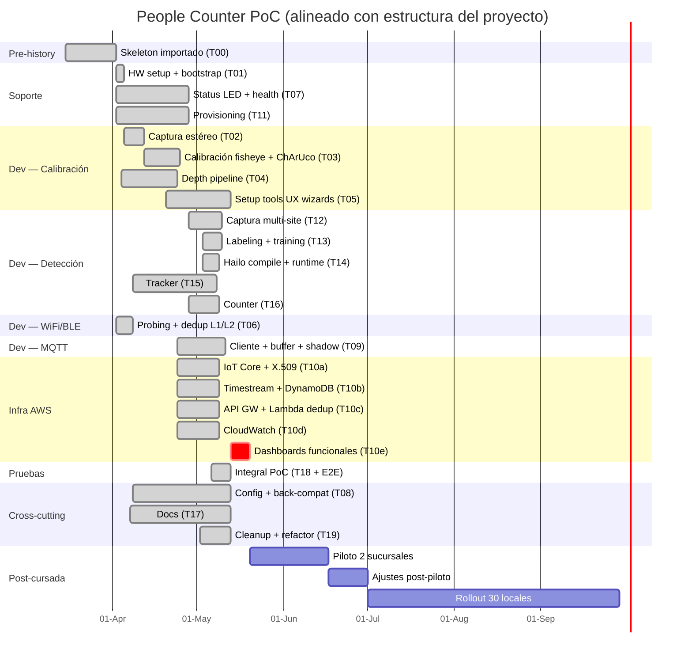
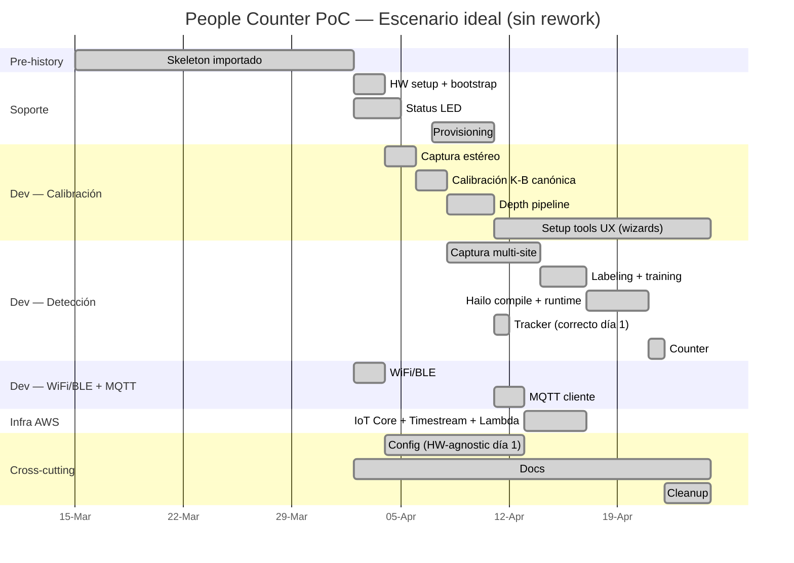

# Project Gantt — People Counter PoC

Gantt del proyecto reconstruido a partir del historial de git, alineado
con la estructura formal del plan de proyecto. Sirve como input para
herramientas de project management (MS Project, GanttProject, etc.) y
como referencia para estimar tareas similares a futuro.

**Período medido**: 2026-04-02 → 2026-05-12 (41 días calendario, 28
activos).
**Esfuerzo medido**: 89.5h efectivas (51 sesiones detectadas por gaps
≥ 1.5h entre commits) + ~40h estimadas del bundle pre-existente que
trajo el initial commit. **Total ≈ 130h**.
**Modalidad**: solo developer, sesiones partidas mañana/noche (3.2h/día
activo promedio, 50% de los días con doble turno).

> **Nota metodológica**. Horas derivadas de timestamps de commits
> agrupados por gaps. Sesión = `(último commit − primer commit) + 30min
> de lead-up`. Sesión de 1 commit cuenta como 30min mínimo. La atribución
> por módulo dentro de una sesión es proporcional al commit count. ±20%
> de error está principalmente en el trabajo previo al primer commit de
> cada sesión (research, debug manual en la Pi sin commit aún).

---

## Estructura del proyecto

Totales por agrupación (medidos del repo):

| Agrupación | Sub-items | Horas | % del medido |
|------------|-----------|-------|--------------|
| **Soporte** | Adquisición + ensamblaje + config | 8.0 | 9% |
| **Dev** | Scripts calib + Detección + WiFi/BLE + MQTT | 59.2 | 66% |
| **Infra (AWS)** | IoT Core + Timestream + Lambda + dashboards | 2.0 | 2% |
| **Pruebas** | Per-módulo + integración E2E | ~5.0 | 6% |
| **Cross-cutting** | Config system + Docs + Cleanup | 13.1 | 15% |
| **Pre-history** | Bundle pre-existente del initial commit | ~40 | (no medido) |
| **Post-cursada** | Piloto + ajustes + rollout | — | (fuera de scope) |

---

### 1. Desarrollo del proyecto — Soporte (8.0h)

**Adquisición + ensamblaje + config del dispositivo.**

| Sub-tarea | T-code | Horas | Inicio | Fin | Predecesoras |
|-----------|--------|-------|--------|-----|--------------|
| Hardware setup + bootstrap (RPi5 + Hailo + cámaras, systemd, verify) | T01 | 3.5 | 04-02 | 04-04 | T00 |
| Status LED + health monitor (cascade worst-first, GPIO) | T07 | 2.0 | 04-02 | 04-27 | T01 |
| Provisioning + disaster recovery (provision.py, certs harvest/deploy) | T11 | 2.5 | 04-02 | 04-27 | T09 |

---

### 2. Desarrollo del proyecto — Dev (59.2h)

#### 2.1. Scripts de calibración (39h, de los cuales ~10h fueron rework)

**Captura estéreo + calibración fisheye + depth + UX de los wizards.**

| Sub-tarea | T-code | Horas | Inicio | Fin | Predecesoras |
|-----------|--------|-------|--------|-----|--------------|
| Captura estéreo (picamera2 dual cam, raw mode, timestamps) | T02 | 4 | 04-03 | 04-09 | T01 |
| Calibración fisheye + ChArUco (K-B solve, dual-pass detect) | T03 | 12 | 04-03 | 04-23 | T02 |
| Depth pipeline (SGBM + WLS filter, world coords) | T04 | 5 | 04-04 | 04-23 | T03 |
| Setup tools UI — wizards browser-driven (focus_assist, calibrate, preview, roi_picker, diagnose_*) | T05 | 18 | 04-20 | 05-12 | T03, T04 |

> **Rework dentro de T03 (~10h de 12h)**. Las primeras dos semanas de
> calibración fueron en su mayoría rework por modelo incorrecto. Tres
> sub-fases distinguibles en el log:
>
> 1. **Modelo de cámara equivocado (Abr 3-4, ~4h)**. Intentos sucesivos
>    de pinhole rational, fisheye+pinhole híbrido, fallback automático
>    a pinhole, múltiples "fix fisheye stereoCalibrate". Cada iteración
>    rompía algo distinto.
> 2. **Lente OV5647 170° intratable (Abr 6-7, ~3.5h)**. Grid weighted
>    para fisheye extremo, toggles de USE_INTRINSIC_GUESS y CHECK_COND,
>    center-crop pinhole como último recurso. 14 commits en un solo día
>    debugueando rechazos del solver con threshold reproj.
> 3. **Migración a IMX708 + sensor mode footgun (Abr 9-20, ~2.5h)**. La
>    lente OV5647 era inviable; cambio físico de hardware al Arducam
>    IMX708 (120° HFOV, mucho más manejable). Después se descubrió el
>    footgun de picamera2 Mode 0 vs Mode 1 (`f_px=2050 not 1330`).
>
> Sólo ~2h fueron desarrollo "productivo" del modelo correcto
> (Kannala-Brandt canónico estable, commit Abr 23). Para un proyecto
> similar con la lente y la sensor-mode-policy correctas desde día 1,
> presupuestar **3-4h en lugar de 12h** para esta sub-tarea.

#### 2.2. Pipeline de detección (16.2h, de los cuales ~2h fueron rework)

**Captura para training + Roboflow + Kaggle + Hailo + tracker + counter.**

| Sub-tarea | T-code | Horas | Inicio | Fin | Predecesoras |
|-----------|--------|-------|--------|-----|--------------|
| Captura multi-site (capture_mjpeg + sample_for_roboflow) | T12 | 4.0 | 04-28 | 05-09 | T03 |
| Labeling + training (Roboflow Smart Polygon + Kaggle T4) | T13 | 3.0 | 05-03 | 05-09 | T12 |
| Hailo compile + runtime integración (NMS, cluster, static suppressor) | T14 | 4.5 | 05-03 | 05-08 | T13 |
| Tracker (Kalman + state machine + reid) | T15 | 3.0 | 04-08 | 05-11 | T04, T14 |
| Counter (ROI + line crossing + foot projection) | T16 | 1.7 | 04-28 | 05-08 | T15 |

> **Rework dentro de T15 (~2h de 3h)**. El tracker inicial (Abr 8) era
> un asociador naive con unidades mixtas (algunos campos en px, otros en
> world coords) y matching single-pass. Funcionó como stub mientras se
> trabajaba la calibración, pero tuvo que ser reescrito en May 6-7 con:
>
> - **Kalman 4-D** (cx, cy, vx, vy) por track en lugar de centroid simple.
> - **Two-stage matching estilo ByteTrack** (alta confianza primero,
>   re-asociación con low confidence después).
> - **2-pass association + central crop en min_depth_at_bbox**.
> - **Velocity decay en estado PENDING** para evitar ghost-drift que
>   producía duplicados.
>
> Para un proyecto similar arrancando con motion model + ByteTrack-style
> desde día 1, presupuestar **1-1.5h en lugar de 3h** para esta sub-tarea.

#### 2.3. WiFi/BLE + deduplicación (2.0h)

| Sub-tarea | T-code | Horas | Inicio | Fin | Predecesoras |
|-----------|--------|-------|--------|-----|--------------|
| WiFi/BLE capture (nexmon + bleak) + hashing + dedup L1/L2 | T06 | 2.0 | 04-02 | 04-07 | T01 |

#### 2.4. Comunicación MQTT (2.0h)

| Sub-tarea | T-code | Horas | Inicio | Fin | Predecesoras |
|-----------|--------|-------|--------|-----|--------------|
| MQTT client + buffer SQLite + cloud shadow | T09 | 2.0 | 04-24 | 05-10 | T01 |

---

### 3. Desarrollo del proyecto — Infra (2.0h hands-on + dashboards pendiente)

**Recursos AWS — todo definido en `infra/cloudformation/people-counter.yaml`.
Las horas hands-on son bajas porque el stack es declarativo; el grueso fue
diseño del data model + permisos IAM.**

| Sub-tarea | T-code | Horas | Inicio | Fin | Predecesoras | Estado |
|-----------|--------|-------|--------|-----|--------------|--------|
| IoT Core + certificados X.509 (Thing registry, policies, MQTT topics) | T10a | 0.5 | 04-24 | 05-08 | T09 | OK |
| Timestream + DynamoDB (tabla de eventos + tabla de dedup) | T10b | 0.5 | 04-24 | 05-08 | T10a | OK |
| API Gateway + Lambda dedup L3 (función inter-cam) | T10c | 0.8 | 04-24 | 05-08 | T10b | OK |
| CloudWatch (logging + métricas básicas) | T10d | 0.2 | 04-24 | 05-08 | T10a | OK (mínimo) |
| Dashboards funcionales (QuickSight u otro) | T10e | — | — | — | T10b | **Pendiente** |

> Total medido: ~2.0h. El "dashboard funcional" no está construido todavía.
> Una vez con datos reales del PoC, presupuestar **3-5h** para una primera
> versión en QuickSight conectado a Timestream.

---

### 4. Desarrollo del proyecto — Pruebas (~5.0h dedicadas)

**Per-módulo el testing fue interleaved con el desarrollo (los commits
"validated on hardware" están dentro de cada T-task). Acá listo solo las
horas dedicadas explícitamente a pruebas que no son testing inline.**

| Sub-tarea | Detalle | Horas | Hito gatillado |
|-----------|---------|-------|----------------|
| Calibración estéreo | Iteraciones de calibrate + diagnose_depth en lab — ya contadas en T03 | (en T03) | M2 |
| Prueba detección en dispositivo | bench_detector + smoke runs en Pi — ya contadas en T14 | (en T14) | M4 |
| Prueba WiFi/BLE + dedup | "WiFi/BLE validated on RPi5" — ya contadas en T06 | (en T06) | — |
| Prueba conexión con AWS | MQTT smoke + shadow round-trip — ya contadas en T09 | (en T09) | — |
| **Prueba integral (PoC completa)** | tests/test_integration_e2e.py + smoke E2E manual | ~5.0 | M5 |

> Los 727 tests de pytest están en `T18` (cross-cutting) y se ejecutaron a
> lo largo de todo el desarrollo. Sin contar el bundle de 129 tests
> pre-existentes del T00.

---

### 5. Cross-cutting (13.1h)

**Plataforma común que habilita el resto pero no encaja 1:1 en ningún
módulo funcional. Suele ser overhead invisible — para un proyecto similar
a futuro, presupuestar ~20% del total.**

| Sub-tarea | T-code | Horas | Inicio | Fin |
|-----------|--------|-------|--------|-----|
| Config system (loader, deep-merge, HardwareParams, back-compat renames) | T08 | 5.0 | 04-08 | 05-12 |
| Docs (setup-guide, lab-calibration-guide, pilot-operator-guide, privacy, project-gantt) | T17 | 3.6 | 04-07 | 05-12 |
| Refactoring + cleanup (hardware-agnostic, training_data/ unify, dead code, ruff sweeps) | T19 | 4.5 | 05-02 | 05-12 |

---

### 6. Pre-history (~40h, no medidas en git)

| T-code | Detalle | Estimado |
|--------|---------|----------|
| T00 | Skeleton del repo importado al primer commit: 20 módulos en `src/`, 129 tests de pytest, pyproject, estructura base | ~40h |

> El initial commit (`7882dab`, 2026-04-02 16:40) trajo trabajo previo
> bundleado que git no puede medir. Estimación gruesa basada en el volumen
> de código (20 módulos + 129 tests pasaron a estar tracked en un solo
> commit). Si ese código vino de otro repo trackeado, ahí estaría el dato
> exacto.

---

### 7. Post-cursada (fuera de scope del PoC)

**Trabajos que existen en el roadmap del producto pero NO en el scope de
este PoC.** El proyecto entregable es 1 dispositivo, no una flota
desplegada. Estos bloques quedan listados con estimación gruesa para
referencia.

| Sub-tarea | Estimado | Predecesoras | Notas |
|-----------|----------|--------------|-------|
| Piloto en 2 sucursales | 40-60h | M5 (E2E OK) + 2 unidades adicionales fabricadas | Visita técnica × 2 + setup + 2 semanas de operación + recolección de issues |
| Ajustes post-piloto | 15-30h | Datos del piloto | Tuneo de tracker/counter, ajuste de ROIs por site, edge cases de oclusión, retraining del detector si hace falta |
| Rollout progresivo a 30 locales | 100-200h | Ajustes estables | Fabricación + provisioning + visitas técnicas (estimar ~3-6h por local incl. logística) + soporte 1er mes |

> **Out of scope para el PoC actual.** Estimaciones para planning a largo
> plazo; el PoC sólo requiere demostrar el pipeline E2E con **un**
> dispositivo.

---

## Hitos

| ID | Hito | Fecha | Trigger | Agrupación |
|----|------|-------|---------|------------|
| M0 | Skeleton inicial (módulos + tests pre-existentes importados) | 04-02 | T00 | Pre-history |
| M1 | Hardware verificado (cámaras + Hailo + servicios up) | 04-04 | T01 | Soporte |
| M2 | Calibración estéreo aceptable (RMS < 0.5 px) | 04-15 | T03 | Dev / Pruebas calib |
| M3 | Setup tools UX completo (wizards en browser, AE lock canónico, dual-pass) | 05-12 | T05 | Dev |
| M4 | Detector fine-tuned corriendo en Hailo | 05-08 | T14 | Dev / Pruebas detección |
| M5 | Pipeline E2E con conteo validado | 05-08 | T16 | Pruebas integral |

---

## Grafo de dependencias

```
T00 ──┬─→ T01 ──┬─→ T02 → T03 ──┬─→ T04 ──┬─→ T05  (setup tools UX)
      │         │                │         │
      │         │                │         └─→ T15 → T16  (tracking → counting)
      │         │                │              ↑
      │         │                └─→ T12 → T13 → T14 ────┘  (detector pipeline)
      │         │
      │         ├─→ T06 (wifi_ble — independiente)
      │         ├─→ T07 (status led — independiente)
      │         ├─→ T08 (config — cross-cutting)
      │         └─→ T09 → T10a/b/c/d (mqtt → cloud)
      │              ↓
      │              └─→ T11 (provisioning)
      │
      ├─→ T17 (docs cross-cutting)
      ├─→ T18 (tests cross-cutting)
      └─→ T19 (cleanup, requiere madurez de T05/T08/T12)
```

### Camino crítico

`T00 → T01 → T02 → T03 → T04 → T15 → T16` = pipeline mínimo viable.

Suma del camino crítico: **40 + 3.5 + 4 + 12 + 5 + 3 + 1.7 ≈ 69h**.

Las 53h restantes son ramas en paralelo que no bloquean el E2E:

- WiFi/BLE (T06) — vía propia, output va a MQTT
- Status LED (T07) — vía propia, sin downstream
- MQTT/Cloud/Provisioning (T09 → T10 → T11) — pipeline de publishing
- Setup tools UX (T05) — paralelo al detector, no bloquea runtime
- Detector (T12 → T13 → T14) — más caro en wall-clock que en horas reales por el ciclo Roboflow → Kaggle → Hailo (cada etapa tiene wait externo)

---

## Mermaid Gantt



---

## Horas por semana

```
semana del     vis    det    trk    cfg    docs   otros    TOTAL
─────────────────────────────────────────────────────────────────
30-Mar        8.2h   0.3h    -      -      -      6.0h    14.1h   (arranque)
06-Abr        4.9h    -     0.7h   0.7h   0.1h    2.0h     8.4h
13-Abr        1.6h   0.5h    -     0.5h   0.7h    1.6h     4.9h   (semana corta)
20-Abr       11.0h   1.2h   0.3h    -     1.6h    4.7h    18.8h   ← wizard sprint
27-Abr        8.5h   4.0h   0.5h   1.5h   0.8h    2.9h    18.2h   ← detector + setup tools
04-May        7.1h   4.4h   2.6h   1.1h    -      5.2h    19.4h   ← detector + tracking + runtime
11-May        1.5h   1.0h   0.5h   1.3h   0.4h    1.1h     5.8h   (cleanup)
```

## Patrón diario detectado

Distribución horaria de commits muestra **dos picos claros**:

```
mañana:    07h ##  08h #  09h #  10h ###
                            ↓
                       gap del trabajo de día
                            ↓
tarde/noche: 18h #####  19h #####  20h ████████ (peak 47c)
             21h ####   22h ######  23h ##  00h ####  01h #
```

- Sesión mañana típica: 07:00-10:30 (~3h)
- Sesión noche típica: 18:00-23:00 (~4-5h) con trasnocheo ocasional hasta 01h
- 50% de los días con doble turno

---

## Observaciones para planning futuro

1. **Rework por modelos incorrectos costó ~12h del total (13%)** — ver
   sección "Rework cuantificado" abajo. La lección concreta: arrancar
   con el modelo correcto desde día 1 ahorra el ~25% del tiempo de
   visión + tracking.
2. **Calibración 12h fue subestimable a priori** — el solver fisheye + cobertura del board es donde se va el tiempo, no en la integración. Una vez identificado el modelo correcto y el sensor mode canónico, son 3-4h. Para futuros sensors / lenses presupuestar 1.5× del baseline correcto.
3. **Setup tools UX (T05) fue el segundo costo más alto (18h)** — wizards browser-driven, AE lock canónico, dual-pass detect, gates de coverage. Un wizard nuevo (ej. para zonas, líneas múltiples, multi-ROI) probablemente cueste 6-10h cada uno.
4. **Detector "barato" en horas locales pero caro en wall-clock** — 11h directas, pero hay 20+ días de calendario entre captura → label → train → compile porque cada etapa tiene wait externo (Roboflow labeling humano, Kaggle queue, Hailo compile en Docker).
5. **Infra AWS hands-on muy bajo (2h)** porque CloudFormation declarativo. Pero los **dashboards funcionales no están** — para un piloto real presupuestar 3-5h adicionales en QuickSight conectado a Timestream.
6. **Cross-cutting suma ~13h (15% del total medido)** — config + docs + cleanup. Para próximos proyectos similares, presupuestar 15-20% extra sobre las feature stories.
7. **Pre-history reutilizable** — el skeleton del T00 (módulos, tests, pyproject, systemd units) es casi proyecto-agnóstico para edge devices similares y se podría usar como template para acortar el T00 de un proyecto análogo a 5-10h en vez de 40.
8. **Pruebas embebidas vs. dedicadas** — el 90% de las pruebas en este proyecto fueron interleaved con el desarrollo (validated-on-hardware commits). Para un cronograma formal con QA separado, presupuestar +20% sobre las horas de dev para una fase de Pruebas explícita.

---

## Rework cuantificado

**De las 89.5h medidas, ~12h (~13%) fueron rework por modelos
incorrectos al inicio.** No es tiempo perdido — fue exploración legítima
para entender la geometría del problema — pero es un costo que en un
proyecto futuro se evita con el conocimiento ya disponible en este repo.

| Concepto | Horas perdidas | Causa raíz | Cómo evitarlo |
|----------|---------------:|------------|---------------|
| Iteraciones de calibración con OV5647 170° | ~3.5h | Lente fisheye extremo (170°) tiene muy mala convergencia del solver y vignette severa. El solver rechazaba 68/82 pares incluso con threshold reproj=1.5. | **Empezar con lente moderado** (≤120° HFOV). El IMX708 con 120° dio RMS <0.5px sin iteraciones. |
| Pelea pinhole rational vs. fisheye vs. híbrido | ~4h | No estaba claro qué modelo correspondía al sensor. Múltiples intentos de hybrid pinhole+fisheye, fallback automático a pinhole. | **Decidir el modelo upfront** a partir de la HFOV del lente: <90° pinhole, ≥90° fisheye Kannala-Brandt. No mezclar. |
| Sensor mode footgun (Mode 0 vs Mode 1) | ~2h | picamera2 elige por defecto Mode 0 (cropeado, HFOV ~80°). La fórmula `f = (W/2)/tan(HFOV/2)` da 1330px, pero el focal real era 2050px. | **Forzar Mode 1 con `raw={"size": (2304, 1296)}`** en TODOS los call sites. Documentado en `feedback_picamera2_sensor_mode.md`. |
| Tracker naive → Kalman 4-D + ByteTrack | ~2h | El tracker inicial era un asociador centroide single-pass con unidades mixtas. Funcionó como stub pero produjo duplicados y ghost-drift. | **Arrancar con motion model Kalman + two-stage matching** desde día 1. ~1.5h vs 3h. |
| Otros (camera L/R swap, R/T extraction, units mixed) | ~0.5h | Bugs de integración menores. | Code review + integration tests temprano. |
| **TOTAL** | **~12h** | | |

**Para presupuestar un proyecto similar a futuro**:

- **Hardware correcto desde día 1** (≤120° HFOV, sensor con full-FOV mode documentado): ahorrás **~6h** en calibración.
- **Algoritmos correctos desde día 1** (Kannala-Brandt fisheye, Kalman + ByteTrack tracker): ahorrás **~5h** entre calibración y tracking.
- **Si el equipo ya tiene este repo como referencia**, el T03+T15 baseline pasaría de 15h a ~5h. El resto del PoC (~75h) sería igual.

---

## Escenario ideal — si hubiéramos arrancado con los modelos correctos

**Hipótesis**: el mismo equipo hace el mismo PoC, pero arranca con
estas decisiones correctas desde día 1:

- **Lente moderado** (Arducam IMX708 120° HFOV, no OV5647 170°).
- **Modelo de calibración correcto** (`cv2.fisheye` Kannala-Brandt, no
  pinhole + rational ni híbridos).
- **Sensor mode canónico** (picamera2 Mode 1 full-FOV con
  `raw={"size": (2304, 1296)}`).
- **Tracker correcto** (Kalman 4-D + two-stage matching tipo ByteTrack
  desde el primer commit).
- **Hardware-agnostic config** (HardwareParams + naming con unidades
  desde día 1, sin back-compat renames downstream).

### Comparación

| Métrica | Medido (actual) | Ideal (sin rework) | Δ |
|---------|----------------:|-------------------:|---:|
| Horas medidas | 89.5h | 75.5h | **-14h (-16%)** |
| Total con pre-history | ~130h | ~115h | -14h |
| Camino crítico | 69h | 58h | **-11h (-16%)** |
| Calendario hasta M5 | 41 días | **~22 días** | -19 días (-46%) |

Las **horas guardadas son ~16%** pero el **calendario se acorta ~46%**
porque el rework cayó sobre el camino crítico: la calibración rota
bloqueaba todo lo que dependía de ella (depth, tracker, counter,
detector — toda la cadena de visión).

### Task table ideal

| ID | Tarea | Horas medidas | Horas ideal | Inicio | Fin | Δ |
|----|-------|--------------:|------------:|--------|-----|---:|
| T01 | HW setup | 3.5 | 3.5 | Abr 02 | Abr 03 | — |
| T02 | Captura estéreo | 4.0 | 4.0 | Abr 03 | Abr 05 | — |
| **T03** | **Calibración K-B canónica** | **12.0** | **3.0** | **Abr 04** | **Abr 06** | **-9h** |
| T04 | Depth pipeline (SGBM+WLS) | 5.0 | 5.0 | Abr 06 | Abr 09 | — |
| T05 | Setup tools UX (wizards) | 18.0 | 18.0 | Abr 09 | Abr 22 | — |
| T06 | WiFi/BLE | 2.0 | 2.0 | Abr 02 | Abr 03 | — |
| T07 | Status LED + health | 2.0 | 2.0 | Abr 02 | Abr 04 | — |
| T08 | Config (HardwareParams desde día 1) | 5.0 | 5.0 | Abr 04 | Abr 12 | — |
| T09 | MQTT cliente | 2.0 | 2.0 | Abr 05 | Abr 07 | — |
| T10 | Infra AWS (CFN + Lambda + Timestream) | 2.0 | 2.0 | Abr 06 | Abr 09 | — |
| T11 | Provisioning | 2.5 | 2.5 | Abr 07 | Abr 10 | — |
| T12 | Detector — captura multi-site | 4.0 | 4.0 | Abr 07 | Abr 13 | — |
| T13 | Detector — labeling + training | 3.0 | 3.0 | Abr 13 | Abr 16 | — |
| T14 | Detector — Hailo compile | 4.5 | 4.5 | Abr 16 | Abr 20 | — |
| **T15** | **Tracker (Kalman+ByteTrack desde día 1)** | **3.0** | **1.5** | **Abr 09** | **Abr 10** | **-1.5h** |
| T16 | Counter | 1.7 | 1.7 | Abr 20 | Abr 21 | — |
| T17 | Docs | 3.6 | 3.6 | cross | cross | — |
| **T19** | **Cleanup** | **4.5** | **2.5** | **Abr 23** | **Abr 25** | **-2h** |
| | **TOTAL** | **89.5** | **75.5** | | | **-14h** |

T19 también baja 2h: no haría falta la migración hardware-agnostic
(ya estaría desde día 1), ni los renames de back-compat, ni el cleanup
de `dataset/`/`download_roboflow.py` legacy.

### Mermaid Gantt ideal



**Hito M5 (E2E count validado): Abr 21 en lugar de May 08**.

### Por qué el calendario baja 46% pero las horas sólo 16%

El rework de calibración (10h) cayó **directo sobre el camino crítico**.
Cada hora de rework de T03 bloqueaba a:

- T04 depth (no se puede hacer SGBM sin calib estable)
- T05 wizards (no se puede armar UI sobre algo roto)
- T12 detector captura (necesita rectificación final)
- T15 tracker (necesita coordenadas 3D)
- T16 counter (necesita tracks)

Por eso del 04-04 al 04-23 (~20 días) hay actividad fragmentada de
calibración. En el escenario ideal, T03 termina el 04-06 y todo lo
demás arranca en paralelo desde entonces.

### Recomendación de presupuesto para un proyecto análogo

| Tipo de proyecto | T00 baseline | T03+T15 baseline | Total medido | Wall-clock |
|------------------|------------:|----------------:|-------------:|-----------:|
| Este PoC actual (modelos descubiertos sobre la marcha) | 40h | 15h | 89.5h | 41 días |
| PoC similar con este repo como referencia | **5-10h** | **5h** | **~60h** | **~20-25 días** |
| PoC nuevo dominio (otra tarea de visión + edge) | 30-40h | 10-15h | 80-100h | 30-40 días |

El repo + memorias + docs (este Gantt incluido) **valen ~30h de ahorro**
para el próximo proyecto con stack similar.

---

## Estimación greenfield — hacer todo desde cero, straightforward

**Hipótesis**: equipo experimentado armando el mismo PoC desde cero,
con el diseño claro desde día 1 (no este repo en frente, pero sí
conocimiento del dominio). No hay rework, no hay debug exploratorio,
no se descubre nada sobre la marcha. **Todo lo que figura acá es trabajo
genuinamente nuevo que hay que hacer**, no rework.

### Task table greenfield

| ID | Tarea | Horas straightforward | Notas |
|----|-------|---------------------:|-------|
| T00 | Skeleton (módulos + tests + pyproject + main.py) | **25-30h** | 20 módulos + ~130 tests + orquestador. Sin descubrimiento de diseño = más rápido que el bundle original, pero hay que escribir el código. |
| T01 | HW setup + bootstrap (RPi5 + Hailo + cámaras + systemd) | 3 | |
| T02 | Captura estéreo (picamera2 dual cam, Mode 1 forzado) | 3 | |
| T03 | Calibración K-B canónica + ChArUco | 3 | Modelo correcto desde día 1 |
| T04 | Depth pipeline (SGBM + WLS + world coords) | 4 | |
| T05 | Setup tools UX wizards (5 tools browser-driven) | 13 | Diseño UX ya pre-pensado; ahorra ~5h vs los 18h medidos |
| T06 | WiFi/BLE + dedup L1/L2 | 1.5 | |
| T07 | Status LED + health monitor | 1.5 | |
| T08 | Config system (HardwareParams + naming canónico desde día 1) | 3 | Sin back-compat shims = -2h vs medido |
| T09 | MQTT cliente + buffer + shadow | 1.5 | |
| T10 | Infra AWS (CFN + Lambda + Timestream + IoT Core) | 2 | |
| T11 | Provisioning + disaster recovery | 2 | |
| T12 | Detector — captura multi-site | 3 | |
| T13 | Detector — labeling + training | 2.5 | Trabajo activo. (Wall-clock adicional: ~3 días de espera externa) |
| T14 | Detector — Hailo compile + integración | 3.5 | Receta conocida |
| T15 | Tracker (Kalman + ByteTrack from day 1) | 1.5 | |
| T16 | Counter (ROI + line crossing) | 1.5 | |
| T17 | Docs (setup + lab + privacy) | 3 | |
| T18 | Tests E2E + integración explícita | 3 | Más allá de los tests embedded en cada T |
| T19 | Cleanup / hygiene normal | 1.5 | Sin deuda técnica acumulada |
| **TOTAL** | | **~78-83h** | |

### Operaciones físicas (despliegue del dispositivo PoC)

Las horas de la task table son **desarrollo de software**. Aparte hay
trabajo **físico / operativo** que hay que hacer una vez para poner el
dispositivo PoC en funcionamiento. No es desarrollo — son procedimientos
documentados que se ejecutan con tooling ya construido (verify_hardware,
setup_device.sh, focus_assist, calibrate, roi_picker).

| Actividad | Hands-on | Wait | Notas |
|-----------|---------:|-----:|-------|
| **Ensamblaje del dispositivo** (RPi5 + Hailo HAT + 2× IMX708 + bracket 140mm + PoE HAT + LED RGB + microSD + enclosure) | 4h | — | Tornillería + dupont + termofit. Una vez por unidad. |
| **Foco con lab protocol universal** (mount a 2.0m, target a 1.5m, ambos lentes, esmalte transparente al seam para fijar) | 1h | +15-20min touch-dry / 30-60min cure full | Llave dedicada durante el foco, se retira antes de pintar |
| **Calibración estéreo** (wizard browser-driven, ChArUco A3 a 1.0/2.0/3.0m, ~20 poses con coverage gates) | 1.5h | — | Validar con diagnose_depth.py (error <5% a 2m) |
| **Provisioning del device** (flash SD con OS, ejecutar setup_device.sh, escribir /etc/people-counter/config.yaml, dropear calib.npz + HEF + certs X.509, enable services) | 2.5h | — | Mayormente wait por installs apt |
| **ROI + líneas de conteo** (`roi_picker.py` en el local final, definir ROI rectangular + línea virtual con etiquetas ingress/egress) | 1h | — | Necesita la Pi montada en su posición real |
| **Validación E2E** (walk-through con personas, verificar eventos MQTT, dashboard cloud recibiendo, tunear thresholds si hace falta) | 2h | — | Iterativo según los walk-throughs |
| **TOTAL operaciones PoC** | **~12h** | **+ ~30min cure del esmalte** | |

> **Calendario operaciones**: con esmalte (touch-dry 15-20min, full
> 30-60min) **todo entra en una sola sesión de lab + un día de visita
> al local**. Día 1: ensamblaje + flash + foco + esmalte + calibración
> + ground-truth. Día 2: visita al local, ROI + validación E2E. ~12h
> hands-on totales distribuidas en 2 días, sin esperas overnight.

### Dimensionamiento del dataset del detector — iterativo vs bulk

El detector cenital es un fine-tuning de YOLOv8n preentrenado en COCO,
single-class. La cantidad de datos necesaria depende fuerte de la
estrategia que adoptes.

#### Opción A — Forma correcta: iterativa (~8-10h hands-on, ~300-500 imgs)

El approach metodológicamente correcto es **arrancar con el menor data
posible y agregar sólo si hace falta**. Cada iteración informa la
siguiente, evitando sobre-invertir en data antes de saber si el modelo
base ya alcanza.

**Iter 0 — Validar con stock YOLO (~2h)**

1. Capturar 50-100 frames del sitio destino con el mounting real (no
   prototype).
2. Correr `yolov8n.pt` stock COCO con `scripts/training/bench_detector.py`.
3. Evaluar: ¿qué recall sobre cabezas cenitales? ¿Qué tipos de fallo?

> Si stock detecta ≥80% de personas cenitales con confianza ≥0.5,
> probablemente alcance con stock + postproceso geométrico (cluster
> post-NMS + containment filter + static suppressor) sin fine-tuning.
> Saltás Iter 1 y Iter 2.

**Iter 1 — Fine-tune mínimo viable (~4-5h)**

1. Si stock no alcanza, capturar ~200-300 frames balanceados (motion +
   bg) del sitio destino — **2-3h de captura en horario pico, 1 site**.
2. `sample_for_roboflow.py` con ~70/30 motion/bg.
3. Smart Polygon labeling: ~30-45min.
4. Train en Kaggle T4: ~20min runtime + queue.
5. Bench sobre held-out validation. Si mAP@0.5 ≥ 0.7 y FP rate
   manejable, **parar acá**.

**Iter 2 opcional — Edge cases (~2-3h)**

- Si la Iter 1 falla específicamente en casos puntuales (niños, gorros,
  oclusiones, multi-persona apretado), capturar **targeted** ~100-200
  frames de esos casos.
- Re-train con dataset expandido (~400-500 imgs total).
- Para un PoC de mounting controlado generalmente no se llega acá.

**Total Opción A**: ~8-10h hands-on, ~300-500 imgs labeled, 2-3 días
calendario.

#### Opción B — Lo que efectivamente se hizo: bulk 5 sites (1h 45min labeling)

Para agilizar el proceso aprovechando infraestructura ya disponible
(el script `capture_mjpeg.py` ya armado + sites del FFC incumbent
accesibles), se hizo **una sola iteración con dataset grande**:

- Captura paralela de **5 sites simultáneamente** con motion-trigger.
- Pool de frames capturados en sesiones intermitentes (conceptualmente
  1 sesión de 10-21h en paralelo bastaba).
- Sample estratificado a **945 imgs** (cerca del cap del Roboflow free
  tier de 1100).
- Smart Polygon labeling: **1h 45min** (~6-7s/img).
- Train + compile a HEF en 1 sola pasada, sin iterar.

**Por qué se justificó el atajo bulk en lugar de iterativo**:

- La infra de captura multi-site **ya existía** del producto roadmap
  más amplio — el costo marginal de capturar de varios sites en
  paralelo era casi cero (workers concurrentes, mismo script, mismo
  wall-clock).
- "Mejor sobre que falto" con un credit cap de Roboflow que de todas
  formas se iba a usar.
- Validar generalización cross-site **anticipó** el rollout futuro a
  flota sin requerir re-trainings.
- Se ahorró el ciclo "stock baseline → ver dónde falla → fine-tune"
  porque ya había evidencia previa (del incumbent FFC) de que el
  stock COCO no anda bien cenital.

#### Comparación rápida

| Parámetro | A: Iterativa mínima | B: Bulk realizado |
|-----------|------------------:|-----------------:|
| Imágenes labeled | 200-300 | **945** |
| Sites capturados | 1 | **5** |
| Sesión de captura | ~3h en 1 día | **1 día (10-21h paralelos)** |
| Labeling time | ~25-35min | **1h 45min** |
| Iteraciones | 1-2 (Iter 0 + 1) | 1 (bulk) |
| Sites diversos validados | Solo el PoC | **5 condiciones** |
| Margen Roboflow free tier | Holgado | OK |
| Total dev sub-proyecto detector | ~8-10h | ~9-11h |

Ambas opciones convergen a ~9-11h totales para el sub-proyecto de
detector — la diferencia real está en la **calidad de generalización
post-deploy** (Opción A puede requerir Iter 2 si encontrás edge cases
en producción; B ya cubre más casos por adelantado al validar 5
condiciones distintas).

---

### Wall-clock irreducible (servicios externos)

Independiente del desarrollo y de las operaciones, hay esperas externas
que **no se pueden compactar** por más straightforward que sea el resto:

| Espera | Duración |
|--------|---------:|
| Provisioning de AWS account + IoT Core registration (si arrancás sin cuenta) | 0.5-1 día |
| Roboflow labeling (945 imgs con Smart Polygon click-por-imagen) | **~2h** (medido: 1h 45min + pausas) |
| Kaggle T4 queue + training run | 1-2 días (con buffer por queue picos) |
| Hailo compile en Docker x86 (~15-30 min × ~3 compiles efectivos) | 0.5 día |
| Captura multi-site con motion-trigger (5 sites en paralelo, 1 sesión 10-21h) | **1 día** (o 2-3 si querés diversidad multi-día) |
| **TOTAL wall-clock irreducible** | **~3-5 días** |

> **Labeling**: Smart Polygon es **mucho más rápido de lo esperado**.
> Con 945 imgs el ritmo medido fue ~9 imgs/min (~6-7 segundos por
> imagen incluyendo click + ajuste + next). Eso se explica porque el
> dataset tiene muchos frames bg sin detección (label "null", click
> rápido) y los positivos suelen ser 1-2 heads claros desde top-down.
> Para datasets con más targets por imagen o donde Smart Polygon
> necesita más ajuste manual, presupuestar más generoso (~3-4h).

> **Captura multi-site — workers en paralelo**: `capture_mjpeg.py`
> levanta un thread por site, no procesa secuencial. **5 sites en
> paralelo en una sesión de 11h (10-21h) producen ~23k frames** (con
> motion-trigger default + bg-interval), 24× lo necesario para el
> dataset de 945. Lo que medimos en la realidad fueron 3 días de
> captura intermitente que produjeron ~11k frames totales — same
> volumen útil. Esfuerzo humano del script: ~30min (kickoff + monitor
> + stop). Para diversidad temporal (luz, patrones de clientes,
> días de semana distintos) querés ≥2 días no consecutivos; para PoC
> con 1 device, 1 día straight suele alcanzar.

### Total real del PoC greenfield

| Concepto | Horas |
|----------|------:|
| Desarrollo de software (T00 → T19) | 78-83h |
| Operaciones físicas (ensamblaje + provisioning + foco + calib + ROI + validación) | ~12h |
| **TOTAL hands-on** | **~90-95h** |
| Wall-clock irreducible adicional (espera externa) | 3-5 días |

### Calendar por dedicación

| Modo de trabajo | Horas/día efectivas | Días activos | Calendario total |
|-----------------|--------------------:|-------------:|----------------:|
| **Full-time dedicado** (sin laburo en el medio) | 7-8h | 13-14 días | **~13-16 días** (2-3 semanas) |
| **Half-time** (4h/día foco real) | 4h | 23-24 días | **~26-32 días** (4-5 semanas) |
| **Part-time como el medido** (mañana + noche, ~3h/día) | 3.2h | 29-30 días | **~35-43 días** (5-6 semanas) |

El **wall-clock irreducible (3-5 días)** marca un piso. Con la
estrategia de **1 sesión de captura 10-21h en paralelo (5 sites
simultáneos)** y compactando los waits externos, **no se puede bajar
de ~10-12 días** incluso con 8h/día y todo perfecto. Los cuellos de
botella son AWS setup (~1 día) + Kaggle queue + Hailo compile. El
labeling (~2h) salió completamente del camino crítico.

### Camino crítico greenfield

`T00 → T01 → T02 → T03 → T12 → T13 → T14 → T15 → T16` = 47h de trabajo
sobre el camino crítico que culmina en M5 (E2E count validado). Las
ramas paralelas (T06 wifi/ble, T07 status, T09/T10/T11 mqtt/cloud, T05
wizards) corren en simultáneo y no extienden el cronograma si hay
capacidad para paralelizar.

### Resumen ejecutivo

> **Si tuvieras que armarlo todo desde cero, sabiendo lo que ya sabés,
> sin descubrir nada sobre la marcha: ~90-95h totales (80h dev + 12h
> ops físicas), distribuidas en ~2-3 semanas si es full-time, ~5-6
> semanas si seguís el patrón mañana/noche actual. El wall-clock no
> baja de ~10-12 días por AWS setup + Kaggle + Hailo. Captura
> multi-site se hace en 1 día con los 5 sites en paralelo (10-21h)
> y labeling con Smart Polygon ~2h — ambos salieron del camino crítico.**

---

## Caveats metodológicos

- Las **horas son aproximadas con ±20% de error**. El método subestima el tiempo previo al primer commit de cada sesión.
- El **T00 de 40h es estimación gruesa**. Si ese código vino de otro repo trackeado, ahí estaría el dato real.
- La **clasificación por T-task agrupa commits por keywords en el mensaje** — algunos commits cross-cutting fueron atribuidos al T-task dominante de la sesión.
- **Wall-clock vs. horas reales no son comparables** — el detector aparece "activo" del 04-28 al 05-09 (12 días) pero acumuló sólo 11.3h efectivas porque la mayor parte está esperando servicios externos.
- **Post-cursada está estimado a ojo** — son números para tener algo en el plan, no compromisos. Refinar cuando se acerque la fase.
