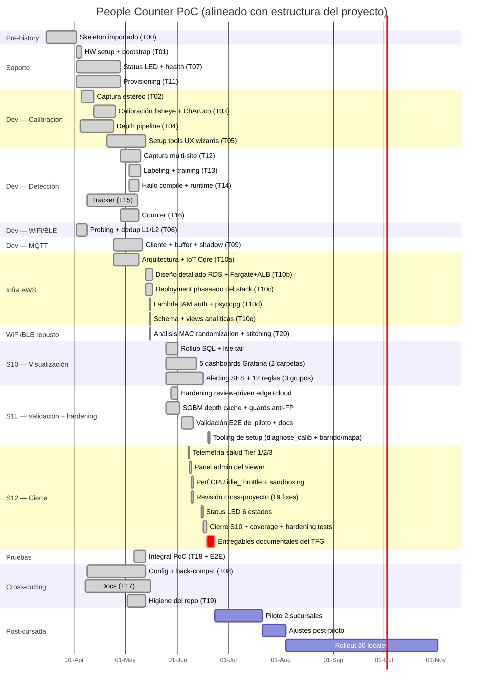
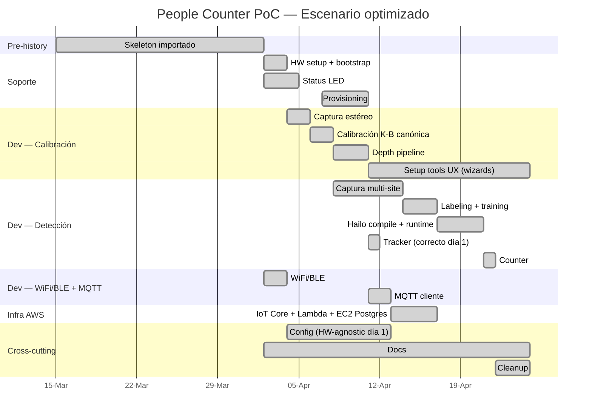

# Project Gantt — People Counter PoC

Gantt del proyecto reconstruido a partir del historial de git, alineado
con la estructura formal del plan de proyecto. Sirve como input para
herramientas de project management (MS Project, GanttProject, etc.) y
como referencia para estimar tareas similares a futuro.

**Período medido**: 2026-04-02 → 2026-06-19 (78 días calendario, ~54
activos).
**Esfuerzo medido**: **186.7h efectivas** en **103 sesiones** (gaps ≥ 1.5h
entre commits) + ~40h estimadas del bundle pre-existente que trajo el
initial commit. **Total ≈ 225-245h**.

> **Regeneración 2026-06-16/17 (cierre de S10 + S11 + S12)**. La versión
> previa de este Gantt estaba congelada al 2026-05-24 (136.9h efectivas).
> Esta regeneración suma el **delta medido 2026-05-24 → 2026-06-15:
> +40.1h efectivas** en 119 commits / 30 sesiones, repartidas S10 12.9h ·
> S11 11.6h · S12 7.0h · S9 5.1h · docs 2.3h · S8 0.7h · S5 0.5h. Cubre:
> cierre de **S10** (5 dashboards Grafana en 2 carpetas + 12 alert rules
> en 3 grupos + capa de rollup SQL incremental + live tail), **S11**
> (hardening review-driven del pipeline edge+cloud, SGBM depth cache,
> guards anti-FP, validación E2E del piloto, docs) y **S12** (perf CPU
> 162%→~50% con `idle_throttle`, sandboxing systemd verificado en HW,
> revisión cross-proyecto de 19 hallazgos, telemetría de salud Tier
> 1/2/3, panel admin del viewer, status LED a 6 estados). Más un **tail
> de +3.2h el 2026-06-16/17** (cierre de S10 con la regla de alerta
> `death_emit/total` + reporte de coverage + pasada de hardening de tests:
> guards del death-emit aislados y resiliencia de las Lambdas a 97-98%).
> El antiguo apunte de la "sesión 2026-05-24 tarde (~6h, total acumulado
> ~143h)" queda subsumido en este delta (la ventana arranca el 2026-05-24).
>
> **Update 2026-06-19 (+~6.5h S11)**. Tooling de setup para espacios chicos /
> luz difícil: `diagnose_bracket` → `diagnose_calibration` (salud post-cal por
> error epipolar), modo **barrido (sweep)** default en el wizard de calibración
> + modo **mapa** default en `focus_assist`, ambos con reporte. Validado en HW
> (barrido → baseline 143.2mm + 0.59px epipolar out-of-sample; mapa de foco
> PASS). Dos sesiones reales (mediodía 11:48-15:59 ~4.2h + noche 19:54-22:07
> ~2.2h; el hueco de ~4h de la tarde queda excluido).

**Modalidad**: solo developer, sesiones partidas mañana/noche (~3.4h/día
activo promedio, ~42% de los días con doble turno mañana+tarde-noche
detectado).
**Métrica de fuente**: timestamps reconstruidos desde el tag local
`pre-rewrite-20260523-143821` (508 commits originales) + delta de
commits post-rewrite con author date > 2026-05-23 (Device Shadow + UI +
tracker hardening). Sin doble-conteo de squashed commits.

> **Nota metodológica**. Horas derivadas de timestamps de commits
> agrupados por gaps. Sesión = `(último commit − primer commit) + 30min
> de lead-up`. Sesión de 1 commit cuenta como 30min mínimo. La atribución
> por módulo dentro de una sesión es proporcional al commit count. ±20%
> de error está principalmente en el trabajo previo al primer commit de
> cada sesión (research, debug manual en la Pi sin commit aún).
>
> **Datos medidos vs. proyecciones**. Las **~172h del PoC actual** (177h
> efectivas, ~172h una vez atribuidas por sprint) salen
> de timestamps reales — son datos. El **escenario optimizado** y el
> **greenfield desde cero** son **proyecciones** basadas en asunciones
> explícitas. Las proyecciones incluyen un buffer de +15% sobre la
> estimación naive para cubrir la fricción operativa normal que aparece
> incluso en escenarios "straightforward" (resolución de dependencias,
> quirks de hardware, configuración de IAM policies, primera ejecución
> del Hailo Docker, etc.).

---

## Resumen ejecutivo

### PoC entregado (datos medidos)

- **186.7h efectivas en 78 días calendario** (2026-04-02 → 2026-06-19),
  ~54 días activos, 103 sesiones partidas mañana/noche detectadas.
- **+ ~40-60h estimadas del skeleton bundleado** en el initial commit
  (20 módulos en `src/` + ~130 tests + pyproject + main.py).
- **Total real del proyecto: ~225-245h hands-on**.

### Distribución del esfuerzo medido

Atribución por sprint (horas reconstruidas desde el tag pre-rewrite, sesión
asignada proporcionalmente al sprint dominante de cada commit). Los "docs"
agrupan README/CLAUDE/guías top-level que tocan varios sprints sin uno
predominante.

| Sprint / bloque | Horas | % del esfuerzo |
|---|---:|---:|
| Docs cross-cutting (README/CLAUDE/plan/gantt) | 32.0h | 18.6% |
| S3 — Calibración estéreo | **29.0h** | **16.9%** |
| S2 — Captura estéreo y servicios | **23.8h** | **13.8%** |
| S11 — Validación y documentación | **25.0h** | **14.0%** |
| S9 — Servicios cloud y APIs | 15.3h | 8.9% |
| S10 — Visualización analítica | **12.9h** | **7.5%** |
| S8 — Mensajería y telemetría | 8.3h | 4.8% |
| S5 — Detección neuronal | 7.8h | 4.5% |
| S6 — Seguimiento y conteo | 7.5h | 4.4% |
| S12 — Cierre del prototipo | **7.0h** | **4.1%** |
| Misc / unmapped (configs, tooling cross) | 7.0h | 4.1% |
| S7 — Captura WiFi y BLE | 2.5h | 1.5% |
| S4 — Profundidad y counting zone | 0.6h | 0.3% |
| **Total atribuido** | **178.6h** | **100%** |

> La tabla cubre la ventana medida hasta 2026-06-15 + el delta de S11 del
> 2026-06-19 (tooling de setup, +6.5h ya sumado a la fila S11 → 25.0h; los %
> de las demás filas quedan ~0.4% altos, dentro del ±error del documento).
> Sumando el tail de +3.2h del 2026-06-16/17 (cierre S10 + coverage +
> hardening de tests, no re-spliteado por sprint) el total efectivo llega a
> **186.7h**. La suma atribuida queda ~5-8h por debajo del efectivo — es el
> mismo desfase de atribución del corte previo (132.0h atribuidas vs 136.9h
> efectivas): la asignación proporcional por commit deja fuera fracciones de
> sesiones con prefijo ambiguo. S10 y S12 entran como filas nuevas (en el
> corte previo aún no tenían esfuerzo medido).

### Hitos del PoC

| ID | Hito | Estado |
|----|------|--------|
| M0 | Skeleton inicial importado | ✓ Done (04-02) |
| M1 | Hardware verificado | ✓ Done (04-04) |
| M2 | Calibración estéreo aceptable (RMS < 0.5 px) | ✓ Done (04-15) |
| M3 | Setup tools UX completo | ✓ Done (05-12) |
| M4 | Detector fine-tuned corriendo en Hailo | ✓ Done (05-08) |
| M5 | Pipeline E2E con conteo validado | ✓ Done (05-08) |
| **M6** | **Stack cloud desplegado E2E: device → IoT → Lambda IAM auth → RDS → Grafana HTTPS** | **✓ Done (05-15)** |
| **M7** | **Dedup WiFi/BLE robusto a MAC randomization: hash groups con 4 reglas de stitching** | **✓ Done (05-15)** |
| **M8** | **S9 cerrado: read-only PostgreSQL para socios + cloud DR documentado + Lambda POS ingest deployada (T9.8 + T9.10 + T9.11)** | **✓ Done (05-23)** |
| **M9** | **Counter production-grade: 3-layer rescue cascade (ghost pool + decisive Kalman + death-emit guards) + telemetry canaries (track_stitching_ratio + ghost_adoption_count + death_emit_count)** | **✓ Done (05-22)** |
| **M10** | **Repo reorganizado: 508 → 124 commits con prefijo `[S<N>/T<X>]` + sanitización + commit_mapping regenerado** | **✓ Done (05-23)** |
| **M11** | **Device Shadow activado end-to-end: 3 toggles overridables (operating_hours + counting_enabled + external_traffic_enabled), persist al config.yaml in-place, validación pre-apply, dedup anti-loop, telemetry canary, UI pills de estado** | **✓ Done (05-24)** |
| **M12** | **Tracker hardening: fix de FP del sitter cerca de la línea por ghost adoption con outside_pos lejano (capa 1 del rescue ahora invalida outside_pos heredado a >150px del adoptante)** | **✓ Done (05-24)** |
| **M13** | **S10 cerrado: 5 dashboards Grafana 13 en 2 carpetas por público (Analítica comercial: Panorama/Comparativa/Detalle/Patrones · Operación y flota: Salud de la flota) sobre la capa de rollup SQL incremental + live tail; 12 alert rules versionadas en 3 grupos (Hardware/Operación/Negocio) con contact point email** | **✓ Done (06-16)** |
| **M14** | **Perf del pipeline edge: CPU 162%→102% (RGB888 sin cvtColor + rect_r lazy + pre-filtro scapy) →~50% en escena vacía con `vision.idle_throttle`, validado E2E en piloto bajo throttle** | **✓ Done (06-09)** |
| **M15** | **Hardening de cierre S12: sandboxing systemd verificado en HW + revisión cross-proyecto (19 hallazgos fixeados) + telemetría de salud Tier 1/2/3 + panel admin del viewer (reboot/apagar) + status LED a 6 estados** | **✓ Done (06-15)** |
| **M16** | **Tooling de setup para espacios chicos / luz difícil: `diagnose_bracket` → `diagnose_calibration` (salud post-cal por error epipolar), modo barrido (sweep) default en calibración + modo mapa default en foco, ambos con reporte. Validado en HW (barrido → baseline 143.2mm + 0.59px epipolar out-of-sample; mapa de foco PASS)** | **✓ Done (06-19)** |
| — | Entregables documentales del TFG (demo en video, capturas, documento final) | **⊘ Pendiente** (fuera del repo; ver plan_sprints.md S12) |

### Iteraciones de diseño exploradas

- **~18h del esfuerzo (~14%) se dedicaron a evaluación de alternativas
  de diseño**:
  - **~10h en calibración** (comparativa OV5647 170° vs IMX708 120°,
    evaluación pinhole + rational vs. fisheye K-B, validación del
    sensor mode canónico).
  - **~2h en el tracker base** (refinamiento del modelo de movimiento
    desde stub centroide a Kalman 4-D + matching estilo two-stage en
    mayo).
  - **~6h en la rescue cascade del counter** (mayo 21-23): tres capas
    complementarias para no perder counts ante detector flakey o
    crossers que se pierden mid-line — ghost pool / ID adoption,
    decisive Kalman cross at exit, y death-emit-if-crossed con guards
    anti-falso-positivo (had_outside_pos + visit_range). Cada capa
    tiene su canary de telemetría (`ghost_adoption_count`,
    `death_emit_count`, `track_stitching_ratio`) para observar el
    balance "agresivo↔conservador" en la flota. El trade-off entre
    capturar walked-then-lost-mid-line vs. evitar doble-conteo del
    drift Kalman se documentó como "rescue con guardrails" en
    CLAUDE.md.
- **Impacto en calendario: ~20 días** (~38% del calendario) porque
  estas iteraciones se ubicaron sobre el camino crítico (calibración →
  depth → tracker → counter → detector encadenados, y la rescue
  cascade del counter en el cierre del PoC).

### Detector — dimensionamiento del dataset

- **Estrategia adoptada (bulk)**: 5 sites capturados en paralelo →
  945 imágenes labeleadas con Smart Polygon en **1h 45min** → train
  Kaggle T4 → compile HEF.
- **Estrategia metodológicamente correcta (iterativa)**: 200-300 imgs
  de 1 site, ~30min labeling, iter 0 con stock YOLO primero. Se
  documentó como Opción A pero **no se siguió** porque la infra de
  captura multi-site ya estaba disponible y validar generalización
  cross-site era valioso para roadmap.

### Proyecciones para futuros proyectos

| Escenario | Hands-on | Wall-clock floor | Calendario full-time |
|-----------|---------:|-----------------:|--------------------:|
| Greenfield desde cero (todo straightforward, +15% buffer) | **~130-155h** | 18-22 días | ~4 semanas |
| Greenfield con este repo como referencia | ~75-90h | 14-18 días | ~3 semanas |
| PoC nuevo dominio visión/edge (sin este repo) | 130-160h | ~30-45 días | ~5-6 semanas |

### Post-cursada (fuera de scope del PoC)

| Ítem | Estimación gruesa |
|------|------------------:|
| Piloto en 2 sucursales | 40-60h |
| Ajustes post-piloto | 15-30h |
| Rollout progresivo a 30 locales | 100-200h |

---

## Estructura del proyecto

Totales por agrupación (medidos del repo):

| Agrupación | Sub-items | Horas | % del medido |
|------------|-----------|-------|--------------|
| **Soporte** | Adquisición + ensamblaje + config | 8.0 | 8% |
| **Dev** | Scripts calib + Detección + WiFi/BLE + MQTT | 59.2 | 59% |
| **Infra (AWS)** | CFN inicial + bring-up real (RDS + ECS Fargate + ALB + ACM + IAM auth + custom domain + schema alignment) | **~10.0** | **10%** |
| **Stitching** | Diseño del dedup en hash groups (seqnum + cross-protocol + BLE anchor) + tests | **~3.5** | **3%** |
| **Pruebas** | Per-módulo + integración E2E | ~5.0 | 5% |
| **Cross-cutting** | Config system + Docs + Cleanup | ~15.0 | 15% |
| **Pre-history** | Bundle pre-existente del initial commit | ~40 | (no medido) |
| **Post-cursada** | Piloto + ajustes + rollout | — | (fuera de scope) |

---

### 1. Desarrollo del proyecto — Soporte (8.0h)

**Adquisición + ensamblaje + config del dispositivo.**

| Sub-tarea | T-code | Horas | Inicio | Fin | Predecesoras |
|-----------|--------|-------|--------|-----|--------------|
| Hardware setup + bootstrap (RPi5 + Hailo + cámaras, systemd, verify) | T01 | 3.5 | 04-02 | 04-04 | T00 |
| Status LED + health monitor (cascade worst-first, GPIO) | T07 | 2.0 | 04-02 | 04-27 | T01 |
| Provisioning + disaster recovery (provision.py, certs harvest/deploy) | T11 | 2.5 | 04-02 | 04-27 | T09 |

---

### 2. Desarrollo del proyecto — Dev (59.2h)

#### 2.1. Scripts de calibración (39h, ~10h en iteraciones de diseño)

**Captura estéreo + calibración fisheye + depth + UX de los wizards.**

| Sub-tarea | T-code | Horas | Inicio | Fin | Predecesoras |
|-----------|--------|-------|--------|-----|--------------|
| Captura estéreo (picamera2 dual cam, raw mode, timestamps) | T02 | 4 | 04-03 | 04-09 | T01 |
| Calibración fisheye + ChArUco (K-B solve, dual-pass detect) | T03 | 12 | 04-03 | 04-23 | T02 |
| Depth pipeline (SGBM + WLS filter, world coords) | T04 | 5 | 04-04 | 04-23 | T03 |
| Setup tools UI — wizards browser-driven (focus_assist, calibrate, preview, counting_zone_picker, diagnose_*) | T05 | 18 | 04-20 | 05-12 | T03, T04 |

> **Iteraciones de diseño dentro de T03 (~10h de 12h)**. Las primeras
> dos semanas de calibración exploraron alternativas del modelo
> óptico hasta consolidar el stack final. Tres sub-fases distinguibles
> en el log:
>
> 1. **Evaluación de modelos de distorsión (Abr 3-4, ~4h)**. Comparativa
>    empírica de pinhole rational, fisheye+pinhole híbrido con fallback,
>    y K-B puro. Cada iteración informó la decisión final de mantener
>    K-B canónico sin mezclas para HFOV ≥ 90°.
> 2. **Comparativa de lentes OV5647 170° vs IMX708 120° (Abr 6-7, ~3.5h)**.
>    Se ejecutó la batería completa con OV5647 170° (grid weighted, toggles
>    de USE_INTRINSIC_GUESS y CHECK_COND, center-crop pinhole). Resultado:
>    la HFOV extrema deja al solver en zona marginal en los bordes —
>    base empírica para fijar el cap de 120° en la spec de hardware.
> 3. **Adopción del IMX708 + caracterización del sensor mode (Abr 9-20,
>    ~2.5h)**. Cambio físico al Arducam IMX708 (120° HFOV) y validación
>    del comportamiento del Mode 0 vs Mode 1 de picamera2 (`f_px=2050`
>    real con Mode 1 full-FOV, distinto del cálculo naive 1330 que asume
>    no-crop).
>
> Sólo ~2h fueron desarrollo "productivo" del path final (Kannala-Brandt
> canónico estable, commit Abr 23). Para un proyecto análogo apoyado en
> las decisiones consolidadas en este repo, presupuestar **3-4h en
> lugar de 12h** para esta sub-tarea.

#### 2.2. Pipeline de detección (16.2h, ~2h de refinamiento del tracker)

**Captura para training + Roboflow + Kaggle + Hailo + tracker + counter.**

| Sub-tarea | T-code | Horas | Inicio | Fin | Predecesoras |
|-----------|--------|-------|--------|-----|--------------|
| Captura multi-site (capture_mjpeg + sample_for_roboflow) | T12 | 4.0 | 04-28 | 05-09 | T03 |
| Labeling + training (Roboflow Smart Polygon + Kaggle T4) | T13 | 3.0 | 05-03 | 05-09 | T12 |
| Hailo compile + runtime integración (NMS, cluster, static suppressor) | T14 | 4.5 | 05-03 | 05-08 | T13 |
| Tracker (Kalman + state machine + reid) | T15 | 3.0 | 04-08 | 05-11 | T04, T14 |
| Counter (counting zone + line crossing + foot projection) | T16 | 1.7 | 04-28 | 05-08 | T15 |

> **Evolución de T15 (~2h de 3h)**. El tracker arrancó (Abr 8) como un
> asociador centroide single-pass — MVP integrador para validar el bucle
> end-to-end mientras se consolidaba la calibración. Una vez disponibles
> los inputs definitivos (depth + counter) se evolucionó en May 6-7 a su
> forma de producción:
>
> - **Kalman 4-D** (cx, cy, vx, vy) por track.
> - **Two-stage matching estilo ByteTrack** (alta confianza primero,
>   re-asociación con low confidence después).
> - **2-pass association + central crop en min_depth_at_bbox**.
> - **Velocity decay en estado PENDING** para extrapolación acotada.
>
> Para un proyecto análogo que arranque con motion model + ByteTrack-
> style desde día 1, presupuestar **1-1.5h en lugar de 3h** para esta
> sub-tarea.

#### 2.3. WiFi/BLE + deduplicación (5.5h)

| Sub-tarea | T-code | Horas | Inicio | Fin | Predecesoras |
|-----------|--------|-------|--------|-----|--------------|
| Captura WiFi/BLE (nexmon + bleak) + hashing + scaffolding del dedup engine | T06 | 2.0 | 04-02 | 04-07 | T01 |
| **Análisis de MAC randomization + diseño del modelo de dedup robusto** (técnicas evaluadas: PNL clustering, seqnum tracking, timing fingerprinting, BLE anchoring, channel timing analysis; selección + implementación de las 4 reglas que balancean accuracy vs privacy) | T20 | **~3.5** | 05-15 | 05-15 | T06, T17 |

> **T20 — análisis del problema y selección de técnicas**: iOS/Android
> randomizan la MAC en probes cada ~2-15min como contramedida
> anti-tracking. Sin stitching, cada rotación cuenta como visitante nuevo
> e infla el conteo 3-15×. El análisis evaluó 5 técnicas publicadas
> (PNL clustering, sequence number tracking, timing fingerprinting, BLE
> anchoring, channel timing analysis) con trade-offs documentados de
> accuracy vs privacy regression vs costo de implementación.
>
> El modelo final usa **4 reglas complementarias** sobre el abstracto
> `hash_groups`: (1) **seqnum continuity 802.11** — el seqnum del chip
> tiende a ser continuo cross-MAC-change (defeated por Apple H1+ con
> reset, funciona en Android); (2) **cross-protocol L2 short window** —
> WiFi+BLE simultáneo con RSSI compatible; (3) **BLE anchoring long
> window** — durante la vida de un BLE RPA (~15min iOS), MACs WiFi con
> RSSI compatible se asocian al grupo; (4) **fingerprint continuity** —
> orden de IEs + HT/VHT/HE caps (WiFi) o company ID + Continuity
> subtypes + service UUIDs + TX power (BLE) sobreviven la rotación de
> MAC/RPA, agarrando el caso Apple H1+ donde el seqnum se resetea.
> PNL clustering y timing
> fingerprinting se rechazaron — el primero por cruzar la línea de
> "fingerprinting comportamental" del producto (vendemos privacy-first),
> el segundo por signal débil.
>
> Privacy preservada en todos los layers: seqnum y timestamps quedan SOLO
> en SQLite local (rotado diario), lo único que sale del device por MQTT
> sigue siendo `{passersby, shoppers}` post-stitching. Se agregó canary
> `wifi_ble_stitching_ratio` (groups/hashes del día) en telemetry para
> monitorear efectividad del stitching en la flota (ratio sostenido en
> 1.0 = stitching no agarra, indica calibrar contra ground-truth cam).

#### 2.4. Comunicación MQTT (2.0h)

| Sub-tarea | T-code | Horas | Inicio | Fin | Predecesoras |
|-----------|--------|-------|--------|-----|--------------|
| MQTT client + buffer SQLite + cloud shadow | T09 | 2.0 | 04-24 | 05-10 | T01 |

---

### 3. Desarrollo del proyecto — Infra (~10h hands-on + dashboards pendiente)

**Recursos AWS — todo definido en `infra/cloudformation/people-counter.yaml`
+ `infra/deploy.ps1` (orquestador 5 fases) + `infra/sql/bootstrap.sql`. El
trabajo se distribuyó en dos bloques: arquitectura + diseño detallado del
stack (04-24 → 05-08), y deployment cuidadoso fase-por-fase con validación
intermedia (05-13 → 05-17).**

| Sub-tarea | T-code | Horas | Inicio | Fin | Predecesoras | Estado |
|-----------|--------|-------|--------|-----|--------------|--------|
| Análisis y diseño de arquitectura cloud (IoT Core + certs X.509 + 3 IoT Topic Rules + esqueleto del CFN) | T10a | ~2 | 04-24 | 05-08 | T09 | OK |
| **Diseño detallado del stack**: análisis de trade-offs RDS vs EC2 (operabilidad managed vs $$ free tier), Grafana managed hosting (App Runner vs ECS Express Mode vs Fargate + ALB manual vs EC2 self-hosted) ponderando operabilidad + portabilidad a cuentas AWS futuras + simplicidad de IaC + valor de custom domain para entregable, Lambda VPC vs out-of-VPC con IAM auth (VPC endpoints $$ vs `rds.generate_db_auth_token`). Resultado: VPC + RDS db.t4g.micro + IAM auth + Fargate + ALB + ACM cert con custom domain `grafana.<DomainName>` + ECR + alarmas SNS. ECS Express Mode descartado por la limitación de AWS-managed domain (URL no presentable para TFG); App Runner descartado por sunset 2026-04 + no disponible en cuentas AWS futuras. | T10b | **~4** | 05-13 | 05-17 | T10a | OK |
| **Deployment phaseado**: `infra/deploy.ps1` 5 fases (CFN core → push imagen Grafana a ECR + bootstrap SQL → ACM request-certificate + pause DNS validation → CFN deploy Fargate+ALB → pause CNAME final), con validación intermedia por fase y `-StartFromPhase` para resumir interrupciones de red. 2 pauses manuales aceptadas por simplicidad operacional (mejor que CFN bloqueando con timeout de hora+). | T10c | **~3** | 05-13 | 05-17 | T10b | OK |
| **Lambda persist_event**: diseño del data flow (envelope estándar `{device_id, timestamp, type, data}` → dispatch por tipo → INSERT idempotente en Postgres), auth via `rds.generate_db_auth_token` (token IAM corto, sin password almacenado), packaging con psycopg[binary] manylinux x86_64 para Linux runtime. | T10d | **~1.5** | 05-15 | 05-15 | T10c | OK |
| **`bootstrap.sql` (schema + 6 views)**: count_events / wifi_ble_summary / telemetry / sales como tablas raw + view multi-cam dedup (`wifi_ble_store_traffic` con MAX por store) + views analíticas (`counting_by_bucket`, `turn_in_rate_by_bucket`, rollups hourly) + view de conversion (`store_hourly_summary` con sales join). | T10e | **~0.5** | 05-15 | 05-15 | T10c | OK |
| Dashboards funcionales (5 tableros sobre la capa de rollup + views) — contabilizado en **S10 (12.9h)**, no en Infra | T10f | (S10) | 05-25 | 06-16 | T10e | **OK** (5 dashboards en 2 carpetas + 12 alert rules; ver sección S10) |

> **Total: ~10.5h** distribuidas entre análisis arquitectural (T10a + T10b
> = ~6h), deployment cuidadoso (T10c = ~3h), y refinamiento de capas
> downstream (T10d + T10e = ~2h). El stack consolidado: **RDS Postgres 16.6
> (db.t4g.micro, ~$13/mo) + ECS Fargate Grafana 13 (0.5vCPU/1GB, ~$18/mo)
> + ALB con ACM cert custom (~$16/mo) + Lambda out-of-VPC con IAM auth**
> ofrece operabilidad managed (snapshots automáticos, parche de SO/DB,
> restart sin perder state, ACM auto-renewed, custom domain HTTPS
> presentable) por ~$35/mo total. Producción mantiene la misma
> arquitectura; solo cambia RDS single-AZ → Multi-AZ y, al sumar 2da app
> (sales API/auth), se comparte el ALB via listener rules para amortizar
> el costo fijo del LB.

---

### 4. Desarrollo del proyecto — Pruebas (~5.0h dedicadas)

**Per-módulo el testing fue interleaved con el desarrollo (los commits
"validated on hardware" están dentro de cada T-task). Acá listo solo las
horas dedicadas explícitamente a pruebas que no son testing inline.**

| Sub-tarea | Detalle | Horas | Hito gatillado |
|-----------|---------|-------|----------------|
| Calibración estéreo | Iteraciones de calibrate + diagnose_depth en lab — ya contadas en T03 | (en T03) | M2 |
| Prueba detección en dispositivo | bench_detector + smoke runs en Pi — ya contadas en T14 | (en T14) | M4 |
| Prueba WiFi/BLE + dedup | "WiFi/BLE validated on RPi5" — ya contadas en T06 | (en T06) | — |
| Prueba conexión con AWS | MQTT smoke + shadow round-trip — ya contadas en T09 | (en T09) | — |
| **Prueba integral (PoC completa)** | tests/test_integration_e2e.py + smoke E2E manual | ~5.0 | M5 |

> Los ~1040 tests de pytest están en `T18` (cross-cutting) y se ejecutaron a
> lo largo de todo el desarrollo (1039 passed + 2 skipped, 82% coverage al
> cierre — ver `docs/coverage_report.md`). Sin contar el bundle de 129 tests
> pre-existentes del T00.

---

### 5. Cross-cutting (13.1h)

**Plataforma común que habilita el resto pero no encaja 1:1 en ningún
módulo funcional. Suele ser overhead invisible — para un proyecto similar
a futuro, presupuestar ~20% del total.**

| Sub-tarea | T-code | Horas | Inicio | Fin |
|-----------|--------|-------|--------|-----|
| Config system (loader, deep-merge, HardwareParams, back-compat renames) | T08 | 5.0 | 04-08 | 05-12 |
| Docs (setup_guide, lab_calibration_guide, pilot_operator_guide, privacy, project_gantt) | T17 | 3.6 | 04-07 | 05-12 |
| Higiene del repo (consolidación hardware-agnostic, unificación de training_data/, ruff sweeps) | T19 | 4.5 | 05-02 | 05-12 |

---

### 6. Pre-history (~40-60h, no medidas en git)

| T-code | Detalle | Estimado |
|--------|---------|----------|
| T00 | Skeleton del repo importado al primer commit: 20 módulos en `src/`, 129 tests de pytest, pyproject, estructura base | **~40-60h** |

> El initial commit (`7882dab`, 2026-04-02 16:40) trajo trabajo previo
> bundleado que git no puede medir. **Rango realista** basado en el
> volumen de código (20 módulos + ~130 tests pasaron a estar tracked en
> un solo commit). Honestamente no lo sabemos: si vino de otro repo
> trackeado, ahí estaría el dato exacto; si fue construido en bursts no
> committeados, el upper bound del rango (~60h) es más plausible.

---

### 7. Post-cursada (fuera de scope del PoC)

**Trabajos que existen en el roadmap del producto pero NO en el scope de
este PoC.** El proyecto entregable es 1 dispositivo, no una flota
desplegada. Estos bloques quedan listados con estimación gruesa para
referencia.

| Sub-tarea | Estimado | Predecesoras | Notas |
|-----------|----------|--------------|-------|
| Piloto en 2 sucursales | 40-60h | M5 (E2E OK) + 2 unidades adicionales fabricadas | Visita técnica × 2 + setup + 2 semanas de operación + recolección de issues |
| Ajustes post-piloto | 15-30h | Datos del piloto | Tuneo de tracker/counter, ajuste de ROIs por site, edge cases de oclusión, retraining del detector si hace falta |
| Rollout progresivo a 30 locales | 100-200h | Ajustes estables | Fabricación + provisioning + visitas técnicas (estimar ~3-6h por local incl. logística) + soporte 1er mes |

> **Out of scope para el PoC actual.** Estimaciones para planning a largo
> plazo; el PoC sólo requiere demostrar el pipeline E2E con **un**
> dispositivo.

---

## Hitos

| ID | Hito | Fecha | Trigger | Agrupación |
|----|------|-------|---------|------------|
| M0 | Skeleton inicial (módulos + tests pre-existentes importados) | 04-02 | T00 | Pre-history |
| M1 | Hardware verificado (cámaras + Hailo + servicios up) | 04-04 | T01 | Soporte |
| M2 | Calibración estéreo aceptable (RMS < 0.5 px) | 04-15 | T03 | Dev / Pruebas calib |
| M3 | Setup tools UX completo (wizards en browser, AE lock canónico, dual-pass) | 05-12 | T05 | Dev |
| M4 | Detector fine-tuned corriendo en Hailo | 05-08 | T14 | Dev / Pruebas detección |
| M5 | Pipeline E2E con conteo validado | 05-08 | T16 | Pruebas integral |
| **M6** | **Stack cloud desplegado E2E** (CFN aplicado + Lambda IAM auth + RDS schema + Grafana HTTPS) | **05-15** | **T10c+d+e** | **Infra (AWS)** |
| **M7** | **Dedup robusto** (hash groups con 4 reglas de stitching: seqnum + cross-protocol L2 + BLE anchor + fingerprint) | **05-15** | **T20** | **Stitching** |

---

## Grafo de dependencias

```
T00 ──┬─→ T01 ──┬─→ T02 → T03 ──┬─→ T04 ──┬─→ T05  (setup tools UX)
      │         │                │         │
      │         │                │         └─→ T15 → T16  (tracking → counting)
      │         │                │              ↑
      │         │                └─→ T12 → T13 → T14 ────┘  (detector pipeline)
      │         │
      │         ├─→ T06 ──→ T20 (stitching, post-payload-shape definition)
      │         ├─→ T07 (status led — independiente)
      │         ├─→ T08 (config — cross-cutting)
      │         └─→ T09 → T10a → T10b → T10c → T10d → T10e (mqtt → cloud bring-up)
      │              ↓
      │              └─→ T11 (provisioning)
      │
      ├─→ T17 (docs cross-cutting)
      ├─→ T18 (tests cross-cutting)
      └─→ T19 (cleanup, requiere madurez de T05/T08/T12)
```

### Camino crítico

`T00 → T01 → T02 → T03 → T04 → T15 → T16` = pipeline mínimo viable (M5).

Suma del camino crítico: **40 + 3.5 + 4 + 12 + 5 + 3 + 1.7 ≈ 69h**.

Las ~31h restantes (hasta M5) son ramas en paralelo que no bloquean el E2E:

- WiFi/BLE captura inicial (T06) — vía propia, output va a MQTT
- Status LED (T07) — vía propia, sin downstream
- MQTT/Cloud/Provisioning (T09 → T10 → T11) — pipeline de publishing
- Setup tools UX (T05) — paralelo al detector, no bloquea runtime
- Detector (T12 → T13 → T14) — más caro en wall-clock que en horas reales por el ciclo Roboflow → Kaggle → Hailo (cada etapa tiene wait externo)

**M6 y M7** quedan fuera del camino crítico mínimo porque las ramas de
infra cloud y dedup robusto corren en paralelo al pipeline E2E:

- **M6 — stack cloud E2E** (T10a→e, ~10h): la cadena de análisis
  arquitectural → diseño detallado → deployment phaseado → Lambda con
  IAM auth → schema + views está fuera del camino crítico del E2E del
  device (que termina en M5), pero es prerequisito para que el piloto
  produzca data persistida + visualizable. Para futuros proyectos con
  stack similar, presupuestar **8-12h** para esta cadena — la fase de
  análisis de trade-offs (RDS vs EC2, managed hosting de Grafana, IAM
  auth vs SSM password) es donde se va el grueso del tiempo, no en la
  redacción del YAML.
- **M7 — dedup robusto** (T20, ~3.5h): análisis del problema de MAC
  randomization (5 técnicas evaluadas con trade-offs) + selección de 3
  reglas + implementación + tests. Es prerequisito para que los counts
  WiFi/BLE del piloto sean confiables (sin stitching el inflation es
  3-15×, números no defendibles ante el cliente).

---

## Mermaid Gantt



---

## Horas por semana

```
semana del      TOTAL    foco principal
─────────────────────────────────────────────────────────────────────────────
30-Mar (W14)    14.1h    arranque + bundle initial + scaffolding
06-Abr (W15)     8.4h    captura + setup services
13-Abr (W16)     4.9h    calibración (semana corta)
20-Abr (W17)    18.8h    ← wizard sprint (focus_assist + calibrate UX)
27-Abr (W18)    18.2h    detector + setup tools
04-May (W19)    19.2h    detector + tracking + runtime
11-May (W20)    28.0h    ← cloud deployment + dedup WiFi/BLE 4 reglas + counter parallax
18-May (W21)    26.1h    ← S9 cierre + counter production-grade (rescue cascade) + repo organizado + hardening anti-FP del piloto (05-24)
25-May (W22)    13.8h    S10 dashboards (footfall) + alerting SES + refactor schema S9 (per-window, SQL category) + SGBM depth cache
01-Jun (W23)    16.0h    ← S10 Grafana (5 tableros + rollup SQL + feriados) + telemetría salud Tier 1/2/3 + measure_power + WAL fix dedup + diseño OTA
08-Jun (W24)     3.8h    panel admin del viewer + revisión cross-proyecto (19 fixes) + perf CPU idle_throttle + sandboxing systemd en HW
15-Jun (W25)    10.2h    status LED 6 estados + cierre S10 + coverage + hardening tests + Gantt · 06-19: tooling de setup (diagnose_calibration + barrido/mapa default + reporte, validado en HW)
─────────────────────────────────────────────────────────────────────────────
                181.5h
```

Las semanas W20-W21 concentraron **54.1h (31%) del esfuerzo** — cierre del
cloud + hardening del tracker + organización del repo. El tramo W22-W25
(+43.8h) fue cierre de S10 (Grafana + alerting), perf del pipeline edge,
el hardening de cierre de S12 (coverage + tests) y el tooling de setup del
06-19 (diagnose_calibration + barrido/mapa). El total por semana
(181.5h) queda ~5h por debajo de las 186.7h efectivas — desfase de
atribución (ver nota de la distribución por sprint).

## Patrón diario detectado

Distribución horaria de commits muestra **dos picos claros**:

```
mañana:    07h ##  08h #  09h #  10h ###
                            ↓
                       gap del trabajo de día
                            ↓
tarde/noche: 18h #####  19h #####  20h ████████ (peak 47c)
             21h ####   22h ######  23h ##  00h ####  01h #
```

- Sesión mañana típica: 07:00-10:30 (~3h)
- Sesión noche típica: 18:00-23:00 (~4-5h) con trasnocheo ocasional hasta 01h
- 42% de los días con doble turno mañana+tarde-noche detectado
  (`{mañana <13h} ∩ {tarde-noche ≥17h}` no vacíos)

---

## Observaciones para planning futuro

1. **Las iteraciones de diseño insumieron ~18h del total (14%)** — ver
   sección "Iteraciones de diseño exploradas" arriba. ~10h en
   calibración (sensor + modelo de distorsión) + ~2h en el tracker
   base + ~6h en la rescue cascade del counter (mayo 21-23). La
   lección concreta: un proyecto análogo apoyado en las decisiones
   consolidadas en este repo ahorra ~25-30% del tiempo de visión +
   tracking + counter.
2. **Calibración 12h fue subestimable a priori** — el solver fisheye + cobertura del board es donde se va el tiempo, no en la integración. Con el modelo de distorsión definido upfront y el sensor mode canónico documentado, son 3-4h. Para sensors/lenses nuevos presupuestar 1.5× del baseline consolidado.
3. **Setup tools UX (T05) fue el segundo costo más alto (18h)** — wizards browser-driven, AE lock canónico, dual-pass detect, gates de coverage. Un wizard nuevo (ej. para zonas, líneas múltiples, multi-zona) probablemente cueste 6-10h cada uno.
4. **Detector "barato" en horas locales pero caro en wall-clock** — 11h directas, pero hay 20+ días de calendario entre captura → label → train → compile porque cada etapa tiene wait externo (Roboflow labeling humano, Kaggle queue, Hailo compile en Docker).
5. **Infra AWS ~10.5h con análisis arquitectural dominando el costo** — del total, ~6h fueron análisis de trade-offs (RDS vs EC2, managed hosting de Grafana ponderando operabilidad + portabilidad cross-cuenta + custom domain como entregable, Lambda VPC vs IAM auth out-of-VPC) + diseño detallado del CFN; ~3h deployment phaseado con 2 pausas manuales para DNS (validación ACM + CNAME final); ~2h refinamiento de capas downstream (Lambda + schema). `infra/deploy.ps1` orquesta las 5 fases (CFN core → push imagen + bootstrap SQL → ACM cert + pause DNS → CFN Fargate+ALB → pause CNAME final). Para un proyecto análogo con stack similar, presupuestar **8-12h** repartidas en este balance (análisis dominante, deployment apoyado en CFN declarativo). Los **dashboards funcionales no están** — para piloto real presupuestar 3-5h adicionales armando dashboards en Grafana 13 sobre las views de `bootstrap.sql`.
6. **Cross-cutting suma ~13h (15% del total medido)** — config + docs + cleanup. Para próximos proyectos similares, presupuestar 15-20% extra sobre las feature stories.
7. **Pre-history reutilizable** — el skeleton del T00 (módulos, tests, pyproject, systemd units) es casi proyecto-agnóstico para edge devices similares y se podría usar como template para acortar el T00 de un proyecto análogo a 5-10h en vez de 40.
8. **Pruebas embebidas vs. dedicadas** — el 90% de las pruebas en este proyecto fueron interleaved con el desarrollo (validated-on-hardware commits). Para un cronograma formal con QA separado, presupuestar +20% sobre las horas de dev para una fase de Pruebas explícita.

---

## Iteraciones de diseño exploradas

**De las 89.5h medidas, ~12h (~13%) se dedicaron a evaluar alternativas
de diseño antes de converger al stack final.** Es exploración deliberada
del espacio de soluciones — fundamental para tomar decisiones informadas
y dejar las trade-offs documentadas — y es un costo que un proyecto
análogo futuro se ahorra apoyándose en las decisiones ya tomadas en este
repo.

| Concepto | Horas | Alternativa evaluada y descartada | Camino directo para análogos |
|----------|-----:|------------|---------------|
| Comparativa de lentes: OV5647 170° vs IMX708 120° | ~3.5h | OV5647 con HFOV 170°: convergencia del solver marginal en los bordes (vignette severa, distortion de magnitud extrema). Se descartó tras validar empíricamente. | **Hardware moderado por default** (≤120° HFOV). El IMX708 a 120° converge con RMS <0.5px en una pasada. |
| Evaluación de modelo de distorsión: pinhole rational vs. fisheye K-B vs. híbrido | ~4h | Pinhole + rational con coefs altos: estable en centro, sub-óptimo en periferia para HFOV ≥ 90°. Híbrido pinhole+fisheye con fallback: ingeniería de más, sin ganancia neta. | **Decidir el modelo upfront por HFOV del lente**: <90° pinhole, ≥90° fisheye Kannala-Brandt. No mezclar. |
| Validación del sensor mode canónico (Mode 0 vs Mode 1 del IMX708) | ~2h | picamera2 selecciona Mode 0 por default (binning con crop, HFOV efectivo ~80°). Se documentó el comportamiento + la fórmula focal estándar `f = (W/2)/tan(HFOV/2)` no aplica a binned modes con crop. | **Forzar Mode 1 con `raw={"size": (2304, 1296)}`** en todo call site de picamera2. Knob documentado y testeado. Memoria `feedback_picamera2_sensor_mode.md`. |
| Refinamiento del tracker: stub centroide → Kalman 4-D + ByteTrack | ~2h | Stub centroide single-pass válido para validar el bucle end-to-end; refinado al modelo de producción cuando depth + counter estuvieron listos. El stub cumplió su rol como MVP integrador. | **Arrancar directo con motion model Kalman + two-stage matching** una vez que el resto del pipeline está listo. ~1.5h vs ~3h con bootstrapping. |
| Refinamientos finales de integración (axis convention L/R, extracción R/T, unidades) | ~0.5h | Decisiones de convención que se afinaron durante la integración E2E. | Code review + integration tests temprano. |
| **TOTAL** | **~12h** | | |

**Para presupuestar un proyecto similar a futuro**:

- **Hardware moderado desde día 1** (≤120° HFOV, sensor con full-FOV mode documentado): ahorrás **~6h** en calibración.
- **Algoritmos finales desde día 1** (Kannala-Brandt fisheye, Kalman + ByteTrack tracker): ahorrás **~5h** entre calibración y tracking.
- **Si el equipo ya tiene este repo como referencia**, el T03+T15 baseline pasaría de 15h a ~5h. El resto del PoC (~75h) sería igual.

---

## Escenario optimizado — proyecto análogo con learnings consolidados

**Hipótesis**: el mismo equipo hace el mismo PoC, pero arranca con las
decisiones de diseño finales desde día 1, apoyado en lo aprendido en
este repo:

- **Lente moderado** (Arducam IMX708 120° HFOV).
- **Modelo de distorsión definido upfront** (`cv2.fisheye` Kannala-Brandt
  para HFOV ≥ 90°).
- **Sensor mode canónico** (picamera2 Mode 1 full-FOV con
  `raw={"size": (2304, 1296)}`).
- **Tracker final desde el inicio** (Kalman 4-D + two-stage matching
  tipo ByteTrack, sin pasar por el stub centroide).
- **Hardware-agnostic config** (HardwareParams + naming con unidades
  desde día 1, sin renames intermedios).

### Comparación

| Métrica | Medido (actual) | Optimizado | Δ |
|---------|----------------:|-----------:|---:|
| Horas medidas | 89.5h | 75.5h | **-14h (-16%)** |
| Total con pre-history | ~130h | ~115h | -14h |
| Camino crítico | 69h | 58h | **-11h (-16%)** |
| Calendario hasta M5 | 41 días | **~22 días** | -19 días (-46%) |

Las **horas guardadas son ~16%** pero el **calendario se acorta ~46%**
porque la exploración de alternativas se ubicó sobre el camino crítico:
la calibración estable habilita todo lo que depende de ella (depth,
tracker, counter, detector — toda la cadena de visión), así que cada
hora invertida en consolidar el modelo correcto desbloquea varias
tareas en paralelo.

### Task table ideal

| ID | Tarea | Horas medidas | Horas ideal | Inicio | Fin | Δ |
|----|-------|--------------:|------------:|--------|-----|---:|
| T01 | HW setup | 3.5 | 3.5 | Abr 02 | Abr 03 | — |
| T02 | Captura estéreo | 4.0 | 4.0 | Abr 03 | Abr 05 | — |
| **T03** | **Calibración K-B canónica** | **12.0** | **3.0** | **Abr 04** | **Abr 06** | **-9h** |
| T04 | Depth pipeline (SGBM+WLS) | 5.0 | 5.0 | Abr 06 | Abr 09 | — |
| T05 | Setup tools UX (wizards) | 18.0 | 18.0 | Abr 09 | Abr 22 | — |
| T06 | WiFi/BLE | 2.0 | 2.0 | Abr 02 | Abr 03 | — |
| T07 | Status LED + health | 2.0 | 2.0 | Abr 02 | Abr 04 | — |
| T08 | Config (HardwareParams desde día 1) | 5.0 | 5.0 | Abr 04 | Abr 12 | — |
| T09 | MQTT cliente | 2.0 | 2.0 | Abr 05 | Abr 07 | — |
| T10 | Infra AWS (CFN + IoT Core + Lambda + EC2 Postgres) | 2.0 | 2.0 | Abr 06 | Abr 09 | — |
| T11 | Provisioning | 2.5 | 2.5 | Abr 07 | Abr 10 | — |
| T12 | Detector — captura multi-site | 4.0 | 4.0 | Abr 07 | Abr 13 | — |
| T13 | Detector — labeling + training | 3.0 | 3.0 | Abr 13 | Abr 16 | — |
| T14 | Detector — Hailo compile | 4.5 | 4.5 | Abr 16 | Abr 20 | — |
| **T15** | **Tracker (Kalman+ByteTrack desde día 1)** | **3.0** | **1.5** | **Abr 09** | **Abr 10** | **-1.5h** |
| T16 | Counter | 1.7 | 1.7 | Abr 20 | Abr 21 | — |
| T17 | Docs | 3.6 | 3.6 | cross | cross | — |
| **T19** | **Cleanup** | **4.5** | **2.5** | **Abr 23** | **Abr 25** | **-2h** |
| | **TOTAL** | **89.5** | **75.5** | | | **-14h** |

T19 también baja 2h: no haría falta la migración hardware-agnostic
(ya estaría desde día 1), ni los renames de back-compat, ni el cleanup
de `dataset/`/`download_roboflow.py` legacy.

### Mermaid Gantt optimizado



**Hito M5 (E2E count validado): Abr 21 en lugar de May 08**.

### Por qué el calendario baja 46% pero las horas sólo 16%

Las iteraciones de calibración (~10h) se ubicaron **directo sobre el
camino crítico**. Cada hora de T03 era una hora de espera para:

- T04 depth (no se puede hacer SGBM sin calib estable)
- T05 wizards (no se puede armar UI sobre algo no consolidado)
- T12 detector captura (necesita rectificación final)
- T15 tracker (necesita coordenadas 3D)
- T16 counter (necesita tracks)

Por eso del 04-04 al 04-23 (~20 días) hay actividad fragmentada de
calibración. En el escenario optimizado, T03 termina el 04-06 y todo
lo demás arranca en paralelo desde entonces.

### Recomendación de presupuesto para un proyecto análogo

| Tipo de proyecto | T00 baseline | T03+T15 baseline | Total realista | Wall-clock |
|------------------|------------:|----------------:|---------------:|-----------:|
| Este PoC actual (stack consolidado durante el desarrollo) | 40-60h | 15h | 89.5h medidas | 41 días |
| PoC similar con este repo como referencia | **5-10h** | **5h** | **~75-90h** (con +15% buffer) | **~25-30 días** |
| PoC nuevo dominio (otra tarea de visión + edge) | 40-60h | 12-20h | 130-160h | 35-45 días |

El repo + memorias + docs (este Gantt incluido) **valen ~40-50h de
ahorro** para el próximo proyecto con stack similar (skeleton ya
existe, modelos correctos identificados, gotchas de hardware
documentados, lab protocol definido).

---

## Estimación greenfield — hacer todo desde cero, straightforward

**Hipótesis**: equipo experimentado armando el mismo PoC desde cero,
con el diseño claro desde día 1 (no este repo en frente, pero sí
conocimiento del dominio). Sin exploración de alternativas porque el
stack ya está identificado a priori. **Todo lo que figura acá es trabajo
genuinamente nuevo que hay que hacer.**

### Task table greenfield

| ID | Tarea | Horas | Notas |
|----|-------|------:|-------|
| T00 | Skeleton (módulos + tests + pyproject + main.py) | **35-45h** | 20 módulos + ~130 tests + orquestador. Aún con diseño claro, escribir código real lleva tiempo. |
| T01 | HW setup + bootstrap (RPi5 + Hailo + cámaras + systemd) | 3 | |
| T02 | Captura estéreo (picamera2 dual cam, Mode 1 forzado) | 3 | |
| T03 | Calibración K-B canónica + ChArUco | 3 | Modelo correcto desde día 1 |
| T04 | Depth pipeline (SGBM + WLS + world coords) | 4 | |
| T05 | Setup tools UX wizards (5 tools browser-driven) | **25-30** | AE lock canónico + dual-pass detect + gates de coverage + audio + reportes HTML. Aun con UX pre-diseñada, son 5 wizards con bastante surface area. |
| T06 | WiFi/BLE + dedup L1/L2 | 1.5 | |
| T07 | Status LED + health monitor | 1.5 | |
| T08 | Config system (HardwareParams + naming canónico desde día 1) | 3 | Sin back-compat shims = -2h vs medido |
| T09 | MQTT cliente + buffer + shadow | 1.5 | |
| T10 | Infra AWS (CFN + IoT Core + Lambda IAM auth + RDS Postgres + ECS Fargate + ALB Grafana) | 3 | |
| T11 | Provisioning + disaster recovery | 2 | |
| T12 | Detector — captura multi-site | 3 | |
| T13 | Detector — labeling + training | 2.5 | Trabajo activo. (Wall-clock adicional: ~1-2 días de espera externa) |
| T14 | Detector — Hailo compile + integración | 3.5 | Receta conocida |
| T15 | Tracker (Kalman + ByteTrack from day 1) | **3-4** | Integración + edge cases del state machine + reid + velocity decay. Happy path 1.5h, pero los corner cases siempre aparecen. |
| T16 | Counter (counting zone + line crossing) | 1.5 | |
| T17 | Docs (setup + lab + privacy) | 3 | |
| T18 | Tests E2E + integración explícita | 3 | Más allá de los tests embedded en cada T |
| T19 | Cleanup / hygiene normal | 1.5 | Sin deuda técnica acumulada |
| **Subtotal naive** | | **~101-117h** | Suma directa, sin buffer |
| **+15% fricción operativa** | | **+15-18h** | Deps rotas, IAM friction, Hailo Docker que falla primera vez, etc. |
| **TOTAL greenfield realista** | | **~116-135h** | |

### Operaciones físicas (despliegue del dispositivo PoC)

Las horas de la task table son **desarrollo de software**. Aparte hay
trabajo **físico / operativo** que hay que hacer una vez para poner el
dispositivo PoC en funcionamiento. No es desarrollo — son procedimientos
documentados que se ejecutan con tooling ya construido (verify_hardware,
setup_device.sh, focus_assist, calibrate, counting_zone_picker).

| Actividad | Hands-on | Wait | Notas |
|-----------|---------:|-----:|-------|
| **Ensamblaje del dispositivo** (RPi5 + Hailo HAT + 2× IMX708 + bracket 140mm + PoE HAT + LED RGB + microSD + enclosure) | 4h | — | Tornillería + dupont + termofit. Una vez por unidad. |
| **Foco con lab protocol universal** (mount a 2.0m, target a 1.5m, ambos lentes, esmalte transparente al seam para fijar) | **1-2h** | +15-20min touch-dry / 30-60min cure full | Los lens M12 tienen play mecánico, casi siempre iterás 2-3 ciclos de foco. Llave dedicada durante el foco, se retira antes de pintar. |
| **Calibración estéreo** (wizard browser-driven, ChArUco A3 a 1.0/2.0/3.0m, ~20 poses con coverage gates) | **1.5-2h** | — | Si alguna pose falla coverage o gate de re-detect, se re-corre. Validar con diagnose_depth.py (error <5% a 2m). |
| **Provisioning del device** (flash SD con OS, ejecutar setup_device.sh, escribir /etc/people-counter/config.yaml, dropear calib.npz + HEF + certs X.509, enable services) | 2.5h | — | Mayormente wait por installs apt |
| **Counting zone + líneas de conteo** (`counting_zone_picker.py` en el local final, definir counting zone rectangular + línea virtual con etiquetas `in`/`out`) | 1h | — | Necesita la Pi montada en su posición real |
| **Validación E2E** (walk-through con personas, verificar eventos MQTT, dashboard cloud recibiendo, tunear thresholds si hace falta) | **2-4h** | — | Primera vez aparecen issues de counting zone/thresholds que requieren tuning iterativo. 2h es el caso happy-path, 4h con tuning normal. |
| **TOTAL operaciones PoC** | **~14-18h** | **+ ~30min cure del esmalte** | |

> **Calendario operaciones**: con esmalte (touch-dry 15-20min, full
> 30-60min) **todo entra en una sola sesión de lab + un día de visita
> al local**. Día 1: ensamblaje + flash + foco + esmalte + calibración
> + ground-truth. Día 2: visita al local, counting zone + validación E2E. ~12h
> hands-on totales distribuidas en 2 días, sin esperas overnight.

### Dimensionamiento del dataset del detector — iterativo vs bulk

El detector cenital es un fine-tuning de YOLOv8n preentrenado en COCO,
single-class. La cantidad de datos necesaria depende fuerte de la
estrategia que adoptes.

#### Opción A — Forma correcta: iterativa (~8-10h hands-on, ~300-500 imgs)

El approach metodológicamente correcto es **arrancar con el menor data
posible y agregar sólo si hace falta**. Cada iteración informa la
siguiente, evitando sobre-invertir en data antes de saber si el modelo
base ya alcanza.

**Iter 0 — Validar con stock YOLO (~2h)**

1. Capturar 50-100 frames del sitio destino con el mounting real (no
   prototype).
2. Correr `yolov8n.pt` stock COCO con `scripts/training/bench_detector.py`.
3. Evaluar: ¿qué recall sobre cabezas cenitales? ¿Qué tipos de fallo?

> Si stock detecta ≥80% de personas cenitales con confianza ≥0.5,
> probablemente alcance con stock + postproceso geométrico (cluster
> post-NMS + containment filter + static suppressor) sin fine-tuning.
> Saltás Iter 1 y Iter 2.

**Iter 1 — Fine-tune mínimo viable (~4-5h)**

1. Si stock no alcanza, capturar ~200-300 frames balanceados (motion +
   bg) del sitio destino — **2-3h de captura en horario pico, 1 site**.
2. `sample_for_roboflow.py` con ~70/30 motion/bg.
3. Smart Polygon labeling: ~30-45min.
4. Train en Kaggle T4: ~20min runtime + queue.
5. Bench sobre held-out validation. Si mAP@0.5 ≥ 0.7 y FP rate
   manejable, **parar acá**.

**Iter 2 opcional — Edge cases (~2-3h)**

- Si la Iter 1 falla específicamente en casos puntuales (niños, gorros,
  oclusiones, multi-persona apretado), capturar **targeted** ~100-200
  frames de esos casos.
- Re-train con dataset expandido (~400-500 imgs total).
- Para un PoC de mounting controlado generalmente no se llega acá.

**Total Opción A**: ~8-10h hands-on, ~300-500 imgs labeled, 2-3 días
calendario.

#### Opción B — Lo que efectivamente se hizo: bulk 5 sites (1h 45min labeling)

Para agilizar el proceso aprovechando infraestructura ya disponible
(el script `capture_mjpeg.py` ya armado + sites accesibles del roadmap
multi-tenant), se hizo **una sola iteración con dataset grande**:

- Captura paralela de **5 sites simultáneamente** con motion-trigger.
- Pool de frames capturados en sesiones intermitentes (conceptualmente
  1 sesión de 10-21h en paralelo bastaba).
- Sample estratificado a **945 imgs** (cerca del cap del Roboflow free
  tier de 1100).
- Smart Polygon labeling: **1h 45min** (~6-7s/img).
- Train + compile a HEF en 1 sola pasada, sin iterar.

**Por qué se justificó el atajo bulk en lugar de iterativo**:

- La infra de captura multi-site **ya existía** del producto roadmap
  más amplio — el costo marginal de capturar de varios sites en
  paralelo era casi cero (workers concurrentes, mismo script, mismo
  wall-clock).
- "Mejor sobre que falto" con un credit cap de Roboflow que de todas
  formas se iba a usar.
- Validar generalización cross-site **anticipó** el rollout futuro a
  flota sin requerir re-trainings.
- Se ahorró el ciclo "stock baseline → ver dónde falla → fine-tune"
  porque la literatura del dominio y baselines previos ya documentan
  que el stock COCO no generaliza bien a vistas cenitales (entrenado
  con frontal/aerial-ish, no top-down).

#### Comparación rápida

| Parámetro | A: Iterativa mínima | B: Bulk realizado |
|-----------|------------------:|-----------------:|
| Imágenes labeled | 200-300 | **945** |
| Sites capturados | 1 | **5** |
| Sesión de captura | ~3h en 1 día | **1 día (10-21h paralelos)** |
| Labeling time | ~25-35min | **1h 45min** |
| Iteraciones | 1-2 (Iter 0 + 1) | 1 (bulk) |
| Sites diversos validados | Solo el PoC | **5 condiciones** |
| Margen Roboflow free tier | Holgado | OK |
| Total dev sub-proyecto detector | ~8-10h | ~9-11h |

Ambas opciones convergen a ~9-11h totales para el sub-proyecto de
detector — la diferencia real está en la **calidad de generalización
post-deploy** (Opción A puede requerir Iter 2 si encontrás edge cases
en producción; B ya cubre más casos por adelantado al validar 5
condiciones distintas).

---

### Wall-clock irreducible (servicios externos)

Independiente del desarrollo y de las operaciones, hay esperas externas
que **no se pueden compactar** por más straightforward que sea el resto:

| Espera | Duración |
|--------|---------:|
| Provisioning de AWS account + IoT Core registration (si arrancás sin cuenta) | 1-2 días (IAM policies + verificación de cuenta + IoT Core registration) |
| Roboflow labeling (945 imgs con Smart Polygon click-por-imagen) | **~2h** (medido: 1h 45min + pausas) |
| Kaggle T4 queue + training run | 1-2 días (incluso "straightforward" probablemente iterás 2-3 runs por hyperparams o export) |
| Hailo compile en Docker x86 | 0.5-1 día (Docker primera vez + iteración por end-node-names) |
| Captura multi-site con motion-trigger (5 sites en paralelo, 1 sesión 10-21h) | **1 día** (o 2-3 si querés diversidad multi-día) |
| **TOTAL wall-clock irreducible** | **~5-8 días** |

> **Labeling**: Smart Polygon es **mucho más rápido de lo esperado**.
> Con 945 imgs el ritmo medido fue ~9 imgs/min (~6-7 segundos por
> imagen incluyendo click + ajuste + next). Eso se explica porque el
> dataset tiene muchos frames bg sin detección (label "null", click
> rápido) y los positivos suelen ser 1-2 heads claros desde top-down.
> Para datasets con más targets por imagen o donde Smart Polygon
> necesita más ajuste manual, presupuestar más generoso (~3-4h).

> **Captura multi-site — workers en paralelo**: `capture_mjpeg.py`
> levanta un thread por site, no procesa secuencial. **5 sites en
> paralelo en una sesión de 11h (10-21h) producen ~23k frames** (con
> motion-trigger default + bg-interval), 24× lo necesario para el
> dataset de 945. Lo que medimos en la realidad fueron 3 días de
> captura intermitente que produjeron ~11k frames totales — same
> volumen útil. Esfuerzo humano del script: ~30min (kickoff + monitor
> + stop). Para diversidad temporal (luz, patrones de clientes,
> días de semana distintos) querés ≥2 días no consecutivos; para PoC
> con 1 device, 1 día straight suele alcanzar.

### Total real del PoC greenfield

| Concepto | Horas |
|----------|------:|
| Desarrollo de software (T00 → T19) — naive | 101-117h |
| Operaciones físicas (ensamblaje + provisioning + foco + calib + counting zone + validación) | 14-18h |
| Sub-total naive | 115-135h |
| +15% buffer de fricción operativa | +17-20h |
| **TOTAL hands-on realista** | **~130-155h** |
| Wall-clock irreducible adicional (espera externa) | 5-8 días |

### Calendar por dedicación

| Modo de trabajo | Horas/día efectivas | Días activos | Calendario total |
|-----------------|--------------------:|-------------:|----------------:|
| **Full-time dedicado** (sin laburo en el medio) | 7-8h | 18-22 días | **~22-28 días** (4 semanas) |
| **Half-time** (4h/día foco real) | 4h | 32-38 días | **~38-48 días** (6-7 semanas) |
| **Part-time como el medido** (mañana + noche, ~3h/día) | 3.2h | 40-48 días | **~50-62 días** (8-9 semanas) |

El **wall-clock irreducible (5-8 días)** + el **buffer operativo
normal** marcan el piso real. **No se puede bajar de ~18-22 días**
incluso con 8h/día y todo "straightforward", porque la fricción
operativa (resolución de deps, IAM friction, primera ejecución de
Docker, iteraciones de foco normales, etc.) se acumula. Los cuellos
de botella externos son AWS setup (1-2 días) + Kaggle queue + Hailo
compile. El labeling (~2h) salió completamente del camino
crítico, pero el setup tools UX (T05, 25-30h) sigue siendo el bloque
más caro del greenfield.

### Camino crítico greenfield

`T00 → T01 → T02 → T03 → T12 → T13 → T14 → T15 → T16` = **57-69h de
trabajo sobre el camino crítico** (con T00 en 35-45h y T15 en 3-4h)
que culmina en M5 (E2E count validado). Las ramas paralelas (T06
wifi/ble, T07 status, T09/T10/T11 mqtt/cloud, T05 wizards) corren en
simultáneo y no extienden el cronograma si hay capacidad para
paralelizar.

### Resumen del greenfield

> Si tuvieras que armarlo todo desde cero, sabiendo lo que ya sabés,
> sin descubrir nada sobre la marcha pero contando la fricción operativa
> normal: **~130-155h totales** (~100-120h dev + 14-18h ops físicas +
> 15% buffer por entropía de sistema). Distribuidas en ~4 semanas
> full-time, ~8-9 semanas si seguís el patrón mañana/noche actual. El
> wall-clock no baja de ~18-22 días por AWS setup + Kaggle + Hailo +
> fricción operativa normal. Captura multi-site se hace en 1 día con
> los 5 sites en paralelo (10-21h) y labeling con Smart Polygon ~2h —
> ambos salieron del camino crítico. El bloque más caro del greenfield
> es **T05 setup tools UX (25-30h)**.

(Para el resumen del PoC entregado, hitos cumplidos e iteraciones de
diseño exploradas, ver **Resumen ejecutivo** al inicio del doc.)

---

## Próximos pasos sugeridos antes del piloto

Trabajos pendientes prioritarios identificados durante el cierre del PoC,
ordenados por gating del piloto. No son sub-tareas del PoC actual (que
queda entregable con M5+M6+M7); son inputs para el planning del piloto.

### 1. Pre-piloto (~6-8h, 1 semana antes del deploy)

- **Dashboards Grafana básicos (3-5h)** sobre las 6 views ya
  preparadas en `bootstrap.sql`. 3-4 paneles canónicos: counting por
  hora, turn-in rate diario, device health (CPU/Hailo temp + MQTT
  status + buffer backlog), telemetry trend. Sin esto, el piloto
  funciona pero el cliente no tiene visualización del valor que está
  generando.
- **Test de integración local contra Postgres real** (1-2h) que
  invoque la Lambda code real contra un Postgres local con el schema
  de `bootstrap.sql` aplicado. Cubre el escenario "device emite
  payload → Lambda persiste → row legible" sin mocks de psycopg.
- **Baseline de `inflation_ratio` WiFi/BLE en lab** (1-2h). Smoke
  test con la cam midiendo X personas + el WiFi/BLE reportando Y
  passersby + el stitching shippeando ratio Z. Esto da el rango
  esperable de `wifi_ble_stitching_ratio` que el operador del piloto
  debería ver en los dashboards.

### 2. Día de deploy del piloto (~6h hands-on)

- Visita técnica al local: ensamblar enclosure si va externo, montar
  la Pi (~1h).
- Foco con el lab protocol universal + esmalte transparente para fijar
  el lens M12 (~1h hands-on + 30min cure).
- Calibración stereo con el wizard (~1h).
- counting zone + línea con `counting_zone_picker.py` montado en la posición real (~1h).
- Validación E2E con walks manuales y tuning iterativo de thresholds
  (~2h).

### 3. Operación monitoreada (2-3 semanas)

- Daily check de los dashboards (passersby/ins ratio razonable,
  `wifi_ble_stitching_ratio` estable en un rango calibrado, ausencia
  de spikes raros en telemetry).
- Spot check de eventos de conteo vs observación humana en 3-4
  ventanas puntuales (~15min cada una) para validar accuracy del
  detector + tracker + counter end-to-end.

### 4. Inputs adicionales para producción (no gating del piloto)

- **Runbook operativo day-2**: qué hacer si el LED queda en rojo, cómo
  re-provisionar un cert vencido, cómo restart-ear un device remoto
  vía AWS IoT Device Shadow, cómo bajar `pg_dump` del RDS para análisis
  offline. `docs/pilot_operator_guide.md` cubre el setup inicial pero
  no la operación continua.
- **Wiring humano del alarming**: SNS topic configurado en el CFN; falta
  definir quién recibe los emails, si hay escalation y SLA de respuesta.
- **Política de retention del RDS**: para piloto el storage crece sin
  problema; para producción a 30 locales decidir si archivar a S3 los
  rows > 90 días o solo retención por billing.

---

## Caveats metodológicos

- Las **horas son aproximadas con ±20% de error**. El método subestima el tiempo previo al primer commit de cada sesión.
- El **T00 de 40h es estimación gruesa**. Si ese código vino de otro repo trackeado, ahí estaría el dato real.
- La **clasificación por T-task agrupa commits por keywords en el mensaje** — algunos commits cross-cutting fueron atribuidos al T-task dominante de la sesión.
- **Wall-clock vs. horas reales no son comparables** — el detector aparece "activo" del 04-28 al 05-09 (12 días) pero acumuló sólo 11.3h efectivas porque la mayor parte está esperando servicios externos.
- **Post-cursada está estimado a ojo** — son números para tener algo en el plan, no compromisos. Refinar cuando se acerque la fase.
